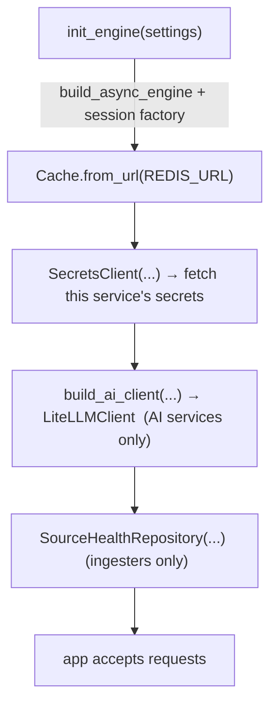

# Implementation Overview

This chapter documents **how the code actually works** — real function
signatures, real configuration values, real control flow — as opposed to
the architectural intent (`05_architecture`) or the per-service catalogue
(`06_services`). Every code reference here is drawn from the repository, not
idealised.

## The one shape every service shares

All 15 services are built from one factory and one startup pattern. The
factory is `tip_common.create_service_app`:

```python
def create_service_app(
    *, settings: BaseServiceSettings, title: str, description: str = "",
    on_startup: list[Hook] | None = None,
    on_shutdown: list[Hook] | None = None,
) -> FastAPI:
    configure_logging(settings.service_name, settings.log_level)
    # lifespan runs on_startup hooks, yields, runs on_shutdown in reverse
    app = FastAPI(title=title, version="0.1.0", lifespan=lifespan)
    app.add_middleware(CorrelationIdMiddleware)
    register_error_handlers(app)
    @app.get("/health") async def health(): return {"status": "ok", "service": ...}
    return app
```

Three things are deliberately wired here and one is deliberately **not**:

| Wired in the factory | Done per-service |
|---|---|
| structured logging | auth middleware (added conditionally, after key fetch) |
| correlation-ID middleware | routers (`include_router`) |
| error handlers (TIP error → HTTP envelope) | startup hooks (engine, cache, secrets, AI) |
| `/health` liveness endpoint | — |

The comment in the factory states the reason auth is not added there:
*"Auth middleware is NOT added here — each service installs it conditionally
so the public key can be fetched at startup rather than at import time."*
This is the fix for the module-load-vs-startup timing problem
(`08_security/authentication.md`).

## The startup hook

Every service's `_startup(app)` follows the same order (from the shared
skeleton in `06_services/README.md`), now annotated with the real calls:



Because the factory's lifespan runs these hooks before uvicorn starts
serving, a service never accepts a request before its engine, cache, and
secrets are ready.

## Module map of the shared layer

The implementation rests on nine packages. The public surface of
`tip_common` (its `__init__.py`) shows what every service imports:

| Symbol | Role in implementation |
|---|---|
| `create_service_app`, `build_lifespan` | the factory + lifespan |
| `BaseServiceSettings` | pydantic-settings base; each service subclasses |
| `CorrelationIdMiddleware`, `get_correlation_id` | request tracing |
| `register_error_handlers`, `TIPError` + subclasses | uniform error envelope |
| `configure_logging`, `get_logger` | structured JSON logs |
| `build_notes_router` + `NoteIn/Out/Update/List` | the analyst-notes factory (Phase 3) |
| `resolve_sort` | shared list-sort parsing |
| `extract_run_id`, `run_with_callback`, `notify_scheduler_complete` | scheduler-callback helpers |
| `fetch_auth_public_key`, `obtain_service_jwt`, `wire_auth` | auth bootstrap helpers |

## How the rest of this chapter is organised

| Document | Covers |
|---|---|
| `backend_implementation.md` | FastAPI routers, dependencies, settings, error envelope |
| `frontend_implementation.md` | Next.js App Router, BFF proxy, SWR, Zustand, ReactFlow |
| `api_implementation.md` | REST conventions, pagination, OpenAPI, status codes |
| `database_implementation.md` | async SQLAlchemy, the engine tuning for PgBouncer |
| `async_implementation.md` | `gather`, `BackgroundTasks`, `ThreadPoolExecutor`, AI serialization |
| `caching_implementation.md` | Redis key spaces, cache-first insights |
| `ai_implementation.md` | LiteLLM client, structured-output synthesis, smart picker |
| `fault_tolerance.md` | `fetch_with_resilience` real policy + circuit breaker |
| `feature_implementation.md` | five real features walked end-to-end |
| `runtime_behavior.md` | boot sequence, bootstrap dance, per-request path |
| `deployment_models.md` | dev overlay vs production-shape, single-host |

Each document grounds its claims in named files and real values. Where a
number is measured (e.g. pool sizes) it is stated as code; where a number is
an operating characteristic observed at runtime (e.g. AI quota limits) it is
labelled as such.
