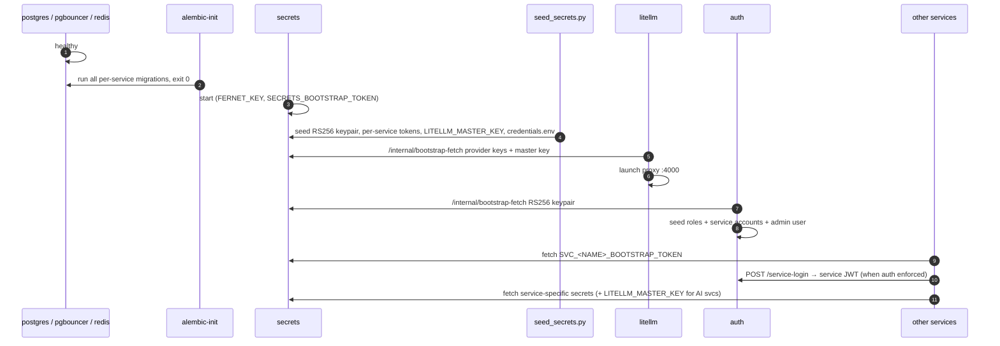
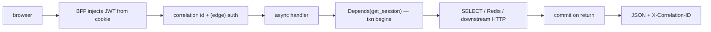

# Runtime Behaviour

This document describes what the platform *does* over time: the cold-boot
bootstrap dance, a warm per-request path, and the scheduled background
rhythm.

## Cold boot — the bootstrap dance

On first deploy, services cannot all start at once because secrets and auth
must exist before anyone can fetch credentials or mint a JWT. The order is
enforced by Compose `depends_on` conditions (`09_devops/orchestration.md`)
and the seed scripts:

The chicken-and-egg is broken by `POST /internal/bootstrap-fetch` on the
secrets service: a pre-auth endpoint that validates the
`SECRETS_BOOTSTRAP_TOKEN` instead of a JWT. It has two modes — single-secret
(`{value}`, used by `SecretsClient`) and bulk (`{secrets:{...}}`, used only
by auth for its keypair) (`08_security/secrets_management.md`).

## The auth-simplification reality

Per the operator decision, **inter-service auth was removed**; data services
run with `DISABLE_AUTH=true` and auth is enforced only at the frontend↔BFF
edge. At runtime this means:

- the `service-login` leg above is a no-op for data services in the current
  deployment (they don't gate inbound calls);
- the only JWT validation that happens on a real request is at the BFF /
  auth edge;
- the services are reachable only inside the Docker network — nothing but
  the frontend port is published (`08_security/attack_surface_analysis.md`).

The wiring for full inter-service auth still exists (`wire_auth`,
`obtain_service_jwt`, lazy public-key middleware) and can be re-enabled by
flipping `DISABLE_AUTH=false`; it is dormant, not deleted.

## Warm per-request path

Once up, a typical read request:

The transaction boundary is the dependency; the correlation id threads into
any downstream `tip_http` call (`backend_implementation.md`).

## Scheduled background rhythm

The scheduler owns all recurring work (12 built-in jobs + a 60s watchdog).
Each job fires an HTTP trigger with a pre-generated `run_id`; fast jobs
answer 200 synchronously, slow jobs answer 202 and call back on completion.

| Cadence | Jobs |
|---|---|
| 30 min | wazuh sync |
| every 2–6 h | news (2h), ioc (3h), threat (4h), orchestrator analyze (6h), vuln CVE (6h) |
| every 12 h | domainwatch check |
| daily | asm 02:00, actors 03:00, geo 05:00, KEV 06:00, EPSS 06:30 |
| 60 s | watchdog (marks stale `running` rows `timeout`) |

The watchdog is what makes a hung ingest visible rather than silently stuck
(`09_devops/monitoring.md`).

## Steady-state resource behaviour

| Resource | Steady-state behaviour |
|---|---|
| Postgres | one DB, 15 schemas; per-service pools (10+15) multiplexed by PgBouncer |
| Redis | hot-path lookups, circuit state, AI cache — flushable any time |
| LiteLLM | single AI egress; smart-model cascade absorbs provider quota |
| Disk | Postgres volume (durable) + domainwatch screenshots (regenerable) |

The platform's runtime signature is: bursty scheduled ingestion, steady
low-volume analyst reads, and occasional expensive AI cycles — which is
exactly the profile the async + cache-first + degrade-gracefully
implementation is tuned for.
