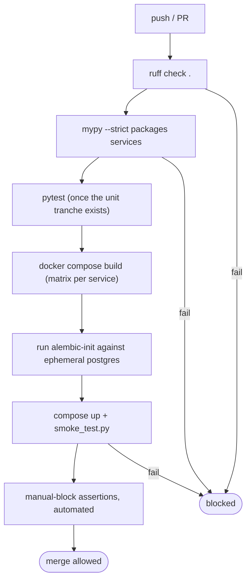

# CI Test Automation

## Honest status: no CI

There is no continuous-integration system wired to this repository (see
`09_devops/ci_cd.md`). No test automation runs on commit or merge. Every
verification layer in this chapter is invoked **by hand**. This document
states that plainly and lays out the concrete, low-effort pipeline that the
existing scripts already make possible.

## Why this is a smaller gap than it looks

The reason the absence of CI is recoverable cheaply is that **the hard part
is already built**: the verification commands all exist and all return
correct exit codes.

| Stage | Tool | Exists? | Exit-code ready? |
|---|---|---|---|
| Lint | `ruff check .` | yes (config in `pyproject.toml`) | yes |
| Type check | `mypy packages services` | yes (strict config) | yes |
| Build | `docker compose build` | yes | yes |
| Migrate | `alembic-init` container | yes | yes (exits 0/non-0) |
| Smoke | `smoke_test.py` | yes | yes (`rc=1` on any failure) |
| AI chain | `check_litellm.py` | yes | yes |
| Frontend walk | `walkthrough.py` | yes | partial (logs failures) |

CI is therefore not a build-from-scratch task — it is an **orchestration**
task: call commands that already exist and already fail correctly.

## The recommended pipeline (future work)

## Phased adoption (cheapest first)

The pipeline should be adopted in the order of effort-to-value:

| Phase | Add | Effort | Value |
|---|---|---|---|
| 1 | pre-commit hook + CI job running `ruff` + `mypy` | minimal (config exists) | locks in the strongest existing layer on every change |
| 2 | CI job: build images + run `alembic-init` on ephemeral Postgres | low | catches build + migration breakage automatically |
| 3 | CI job: `compose up` + `smoke_test.py` + `check_litellm.py` | low | automates the liveness gate |
| 4 | the unit tranche (`unit_testing.md`) run in CI | medium | covers the dangerous pure-logic gap |
| 5 | integration + automated E2E assertions | medium–high | closes the route+DB and untouched-path gaps |

Phase 1 alone — wiring the *already-configured* `ruff` and `mypy` into a hook
and a CI job — would convert the project's strongest manual layer into an
enforced gate at near-zero cost, and is the single highest-leverage testing
improvement available.

## Why it was deferred (honest)

The same reasons as `09_devops/ci_cd.md`: a single developer, a single
deployment host, and a scope that prioritised a working 15-service platform
plus frontend over delivery automation. The cost — no automated regression
gate — is real and is carried explicitly in `15_limitations`. The mitigation
is that every CI stage's command already exists and is exit-code-correct, so
the gap is one of *wiring*, not of *capability*.
