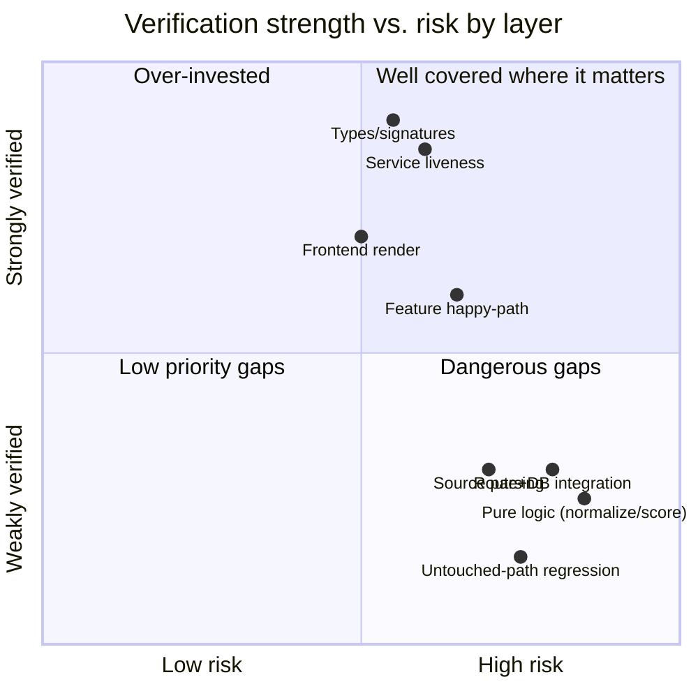

# Test Coverage

## An honest coverage statement

There is **no measured code-coverage number** because there is no automated
test suite to measure (no `pytest`, no `coverage.py` run). Reporting a
percentage would be fabrication. Instead, this document gives an honest
**qualitative** coverage assessment: which layers are well-guarded, which are
thinly guarded, and which are unguarded.

## Coverage by layer (qualitative)

| Layer | Verification | Strength |
|---|---|---|
| Types & signatures | mypy --strict across all packages/services | strong |
| Async correctness | ruff ASYNC family | strong |
| Security smells | ruff bandit (`S`) family | moderate |
| Service liveness | smoke_test.py | strong (boot only) |
| AI chain liveness | check_litellm.py | strong (liveness only) |
| Frontend rendering | Playwright walkthrough (40+ pages) | moderate–strong |
| Feature happy-paths | manual E2E `curl` blocks | moderate (point-in-time) |
| Pure logic (normalize, confidence, resilience) | none | **gap** |
| Route + DB integration | none automated | **gap** |
| Source parsing | none automated | **gap** |
| Cross-cutting `tip_*` blast radius | static analysis only | **thin** |

## The dangerous-gap quadrant

The honest worry is the bottom-right of the matrix: **high-risk code that is
weakly verified.** Three items sit there:

1. **`tip_schemas.indicators.normalize`** — drives the cross-service join
   key; a silent regression mis-correlates IOCs platform-wide. Guarded only
   by types, which cannot catch a wrong-but-typed normalisation.
2. **`tip_schemas.confidence`** — drives ranking; a wrong weight silently
   skews every "most relevant" list. Same guard gap.
3. **Shared `packages/tip_*` changes** — a change here touches all 15
   services at once; only mypy stands between such a change and a fleet-wide
   regression.

These three are the precise targets `unit_testing.md` and `16_future_work`
prioritise — not because they are the largest code, but because they are the
highest risk × lowest current coverage.

## What is genuinely well-covered

It would be equally dishonest to undersell the real safety nets:

- **Every service is proven to boot and stay reachable** on every deploy
  (smoke test), which catches the most common deploy failure outright.
- **The entire type surface is strictly checked**, which in a typed codebase
  catches a large share of what unit tests catch elsewhere.
- **Every user-facing page is exercised** by the walkthrough, which catches
  render-time breakage across the whole frontend.

## Honest bottom line

The platform's verification is **broad but shallow**: it confirms the system
*runs and renders* comprehensively, and confirms its *types* rigorously, but
it does not confirm its *pure logic* or *integration behaviour*
automatically. The coverage profile is appropriate to recognise as a
limitation (`15_limitations`) with a concrete, prioritised remediation path
(`16_future_work`), not to disguise with an invented percentage.
