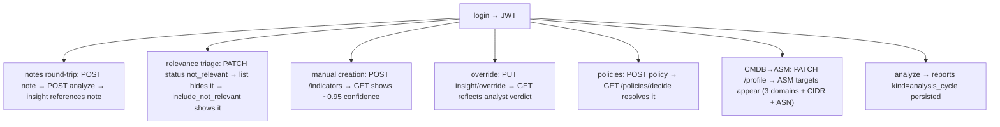

# End-to-End Testing

End-to-end correctness is verified by **manual `curl` sequences** — one per
phase of the build — that drive a real feature path from authentication
through to a persisted result. They are not automated, but they are
**scripted and repeatable**: each is a concrete command list with an
expected outcome, executed against the live stack.

## The shape of an E2E verification block

Each phase of the implementation plan ends with a verification block. The
foundational one (Phase 2) proves the whole stack is wired:

```bash
curl http://localhost:8012/health                 # secrets → 200
curl http://localhost:8000/health                 # auth → 200
TOKEN=$(curl -s -X POST localhost:8000/login \
  -d '{"username":"admin","password":"changeme"}' | jq -r .access_token)
curl -H "Authorization: Bearer $TOKEN" localhost:8007/profile/latest   # seeded profile
curl -X POST -H "Authorization: Bearer $TOKEN" localhost:8011/jobs/news_pull/trigger
curl -H "Authorization: Bearer $TOKEN" "localhost:8001/articles?since=1h"
curl -X POST -H "Authorization: Bearer $TOKEN" localhost:8014/analyze   # 202 + run_id
```

This single block exercises: secrets bootstrap, auth login + JWT issuance,
RBAC-gated read, scheduler trigger, ingestion result, and the AI cycle —
the platform's spine in seven commands.

## Feature-level E2E flows that were verified

The later phases add feature-specific blocks. Representative verified flows:



Each of these was run against the deployed stack and confirmed by inspecting
the resulting DB row or API response (the plan's verification sections list
the exact `jq` assertions, e.g. confidence `~0.95`, `mitre_id` null for a
manual actor, one `profile_change_log` row per relevance flip).

## Specific runtime confirmations on record

Some flows were confirmed with concrete observed outputs (not just "200
OK") — these are the strongest evidence the system works end to end:

| Flow | Observed result |
|---|---|
| `/ask` "tell me about Lazarus" (not in local DB) | 1355-char substantive answer (Bangladesh Bank heist, SWIFT, MITRE techniques) |
| Dorking `example.com` (no Google key) | `backend=duckduckgo, 6 findings` |
| Notification rule with no SMTP configured | dispatch row `skipped`, error "SMTP not configured" |
| KEV backfill | overlap count climbing 12 → 22 → 47 toward ~1500 |
| Auth simplification | domainwatch returns 200 without a token; auth still 401s `/me` without one |

## Honest limitations of this layer

- **Manual.** A human runs the commands and reads the output; nothing
  re-runs them on every change, so a regression in an *untouched* path is
  not caught here.
- **Point-in-time.** They prove the path worked when run, not that it keeps
  working.
- **Not assertion-coded.** The "expected" is described in prose / `jq`
  filters, not encoded as a failing-on-mismatch test.

Converting these blocks into an automated E2E suite (`pytest` driving the
live stack, asserting the same `jq` conditions) is a direct, well-specified
future-work item — the assertions already exist in prose; only the harness
is missing (`16_future_work`).
