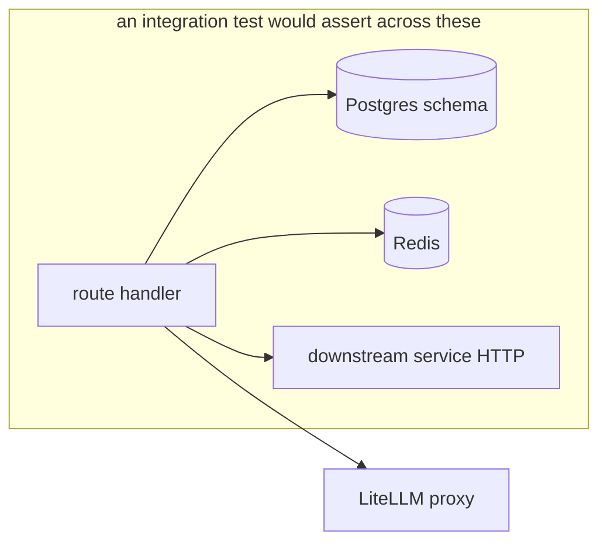
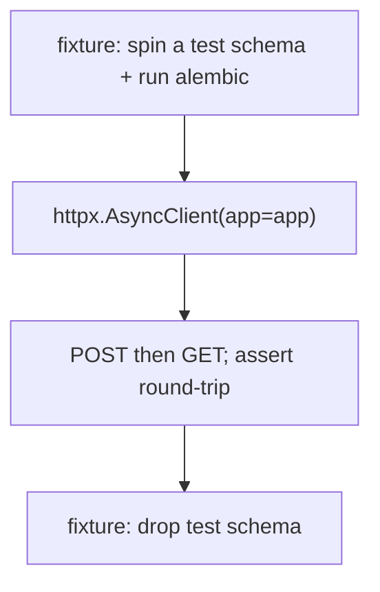

# Integration Testing

## Honest status: no automated integration suite

There are no automated integration tests (route + DB + Redis exercised
together via `httpx.AsyncClient` against a test database). What stands in for
them today is the **smoke layer** (`smoke_testing.md`) plus the **manual
end-to-end verification blocks** (`e2e_testing.md`). This document explains
what integration testing *would* cover and why the current stand-ins are
partial.

## What integration tests would verify

The platform's risk concentrates at boundaries that unit tests cannot reach:

| Boundary | What an integration test would assert |
|---|---|
| route + DB | a `POST` then `GET` round-trips through the real async session + schema |
| transaction | an exception mid-handler rolls back (the `get_session` contract) |
| Redis hot path | `POST /indicators/lookup` populates then hits the cache |
| PgBouncer compat | queries succeed with `statement_cache_size=0` under pooling |
| migrations | `alembic upgrade head` produces the schema the models expect |

The PgBouncer/`statement_cache_size` and migration assertions are
particularly valuable because those are environment-coupled behaviours that
neither mypy nor a unit test can catch
(`10_implementation/database_implementation.md`).

## The current partial stand-ins

| Concern | Current coverage | Gap |
|---|---|---|
| Service boots with real DB | smoke test (`/health` after `up`) | doesn't exercise real queries |
| Migrations apply | `alembic-init` runs on every deploy; failure blocks startup | not asserted in isolation |
| Route + DB correctness | manual `curl` blocks per phase | not automated, not regression-safe |
| Cross-service flow | manual (e.g. analyze → reports) | not automated |

So integration *behaviour* is exercised — every deploy runs migrations and
the smoke test, and features were manually verified end to end — but it is
**not automated or repeatable as a regression gate**.

## The realistic integration-test design (future work)

The natural shape, given the stack, is `pytest-asyncio` + `httpx.ASGITransport`
against the app object, with a disposable Postgres schema per test module:

Because services are isolated by schema and share no tables (`P1`), each
service's integration tests are independent — a property the architecture
makes easy and which `16_future_work` calls out as the reason this gap is
cheap to close per service.
