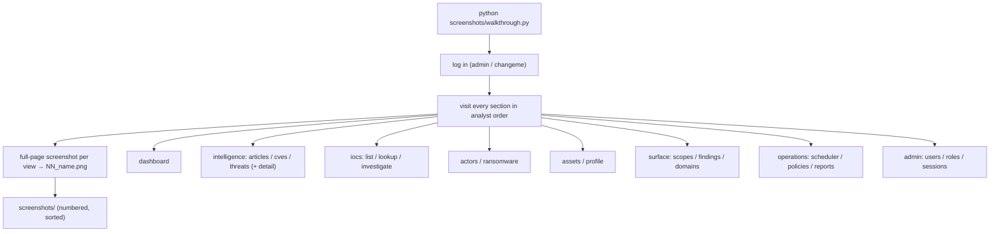
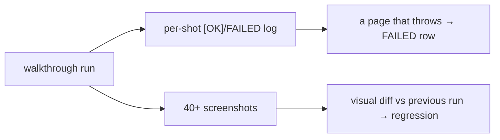

# Playwright Testing

The broadest automated check in the project is a **Playwright walkthrough**
(`screenshots/walkthrough.py`) that drives the real frontend from login
through every major page and captures 40+ full-page screenshots. It is part
visual-regression evidence, part end-to-end frontend smoke test.

## What it does



It targets `http://192.168.150.135:3000` by default (overridable via
`PLATFORM_URL`) and authenticates with the admin credentials, so every shot
is of the **real application rendering real backend data**.

## Resilience built into the script

The walkthrough is written to survive an imperfect platform — exactly the
fault-tolerance philosophy the backend follows:

| Technique | Effect |
|---|---|
| each capture wrapped in `try/except` | one missing page never breaks the whole run |
| detail-page ids resolved from list query results | no hard-coded UUIDs that would rot |
| empty-state captured when data is absent | a page with no threats/IOCs is still documented |
| `domcontentloaded` + fixed settle, not `networkidle` | pages with a 30s `/me` poll don't hang the run forever |

This means a single run produces a complete, ordered visual record even if
some data is sparse — which is what made it usable as a reporting artifact.

## Why it doubles as a test

Although its purpose is screenshots for the report, the walkthrough is the
**most effective regression catch the project has for the frontend**:

- if a page throws on render, its capture fails visibly in the run log
  (`[NN] name FAILED: …`);
- if the BFF proxy or a backend route breaks, the affected page renders an
  error state that the screenshot captures;
- comparing a fresh run's screenshots against a previous run surfaces visual
  regressions (the accent-colour migration and border-radius pass were
  verified this way).



## How it is run

```bash
python screenshots/walkthrough.py          # writes NN_*.png into screenshots/
PLATFORM_URL=http://localhost:3000 python screenshots/walkthrough.py
```

A clean run requires clearing stale images first (`rm screenshots/*.png`) so
the numbered sequence does not duplicate — a lesson from a real
double-run that produced duplicate numbered files.

## Honest limits

- It is a **synchronous, scripted walk**, not an assertion-based E2E suite —
  it proves pages *render*, not that their content is *correct*.
- It runs against a **live** backend, so a backend outage shows as frontend
  errors rather than isolating the fault.
- Visual diffing is **manual** (a human compares runs); there is no
  automated pixel-diff baseline.

Turning it into a true E2E test would mean adding assertions
(`expect(page.getByText(...))`) and a pixel-diff baseline — a natural
extension since the navigation scaffolding already exists
(`16_future_work`). As it stands, it is the single most valuable test
artifact in the repository for the frontend.
