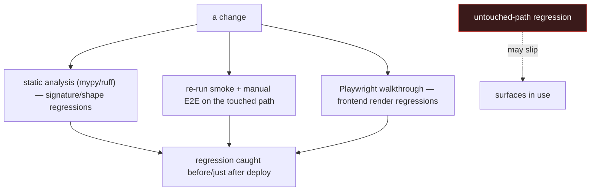
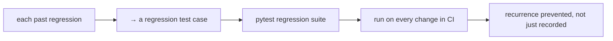

# Regression Testing

## How regressions are actually caught

With no automated test suite, regressions are caught by three real-world
mechanisms rather than a CI gate. This is honest about the fact that the
project has experienced regressions and how they were found and fixed.

## Regressions that actually happened (and how they were caught)

The git history is, in effect, the regression log. Real cases:

| Regression | How it surfaced | Fix (commit) |
|---|---|---|
| Login redirect loop after `api.ts` hardening | manual login attempt failed | `PRE_AUTH_PATHS` bypass (`035ccfc`) |
| "Hunting hypothesis disappeared" | analyst noticed empty insight after quota hit | lossless merge + reject-empty cache (`61ba20a`) |
| KEV "exploited only" returned 12 vs ~1500 | manual filter check returned too few | KEV backfill (`e2443dd`) |
| `.btn primary` still blue | visual inspection / walkthrough | accent sweep to `var(--accent)` (`fe7053f`) |
| scheduler 401 cascade | scheduler job failures observed | service-JWT then auth simplification |
| `threats:write` permission mismatch | trigger returned 403 | corrected the grant |

The pattern is telling: most were caught by **a human exercising the
feature** (manual E2E or visual), not by an automated test. That is the
defining characteristic — and limitation — of the current regression
posture.

## The git history as a regression ledger

Because each fix is a discrete commit with a descriptive message, the
history doubles as documentation of what broke and why. This is weaker than
a regression test (it records the fix, it does not prevent recurrence) but
it does give a future maintainer the context to add the missing test: each
of the rows above is a ready-made unit/E2E test case.

## What would make regression testing real

The highest-value first step is to encode the **already-known** regressions
above as tests — they are pre-specified (the bug, the trigger, and the
correct behaviour are all documented), so writing them is mechanical. For
example: a test that the insight cache never overwrites non-empty content
with empty would permanently lock in the `61ba20a` fix. This is the most
concrete, lowest-risk item in `16_future_work` because every case already
has a known-good and known-bad state.

## Honest assessment

| Property | Status |
|---|---|
| Signature/shape regressions | well-covered (mypy --strict) |
| Touched-path regressions | caught (manual re-verify + walkthrough) |
| Untouched-path regressions | **not reliably caught** (the real gap) |
| Recurrence prevention | absent (fixes recorded, not test-locked) |

The untouched-path gap is the honest weakness: a change to service A cannot
regress service B's tables (`P1` guarantees isolation), but a change to a
shared `packages/tip_*` library *can* affect every service, and only static
analysis currently guards that blast radius.
