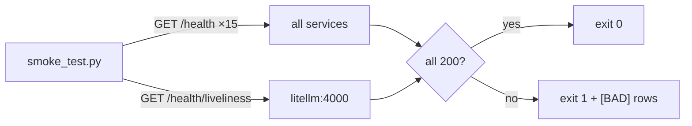

# Smoke Testing

Smoke tests are the platform's automated "is it alive?" layer. Two scripts
in `infra/bootstrap/` make up this layer; both are real, both run from the
host, and both return non-zero on failure so they can gate a deploy.

## `smoke_test.py` — liveness across all 15 services + the AI proxy

The script probes `GET /health` on every service concurrently and the
LiteLLM proxy on its non-standard path, then prints an `[OK]/[BAD]` row per
target and exits non-zero if any failed.

```python
SERVICES = {"auth": 8000, "news-collector": 8001, ... "orchestrator": 8014}
LITELLM_HEALTH_URL = "http://localhost:4000/health/liveliness"

async def _main() -> int:
    async with httpx.AsyncClient() as client:
        tasks = [_probe(client, n, p) for n, p in SERVICES.items()]
        tasks.append(_probe_litellm(client))
        results = await asyncio.gather(*tasks)
    # print [OK]/[BAD] per row; rc=1 if any bad
```

Two implementation details worth noting:

- It uses `asyncio.gather` to probe all 16 targets concurrently — the smoke
  test itself follows the platform's own fan-out pattern.
- LiteLLM is probed **separately** on `/health/liveliness` (its real health
  path) so a `[BAD] litellm` row tells the operator to check the proxy
  *before* chasing AI failures in downstream services — a deliberate
  diagnostic ordering baked into the script's comments.

```bash
make smoke-test            # python infra/bootstrap/smoke_test.py
```



## `check_litellm.py` — the AI-chain smoke test

The AI path is the platform's most failure-prone dependency (provider
quotas, concurrency caps, key routing). `check_litellm.py` exercises a real
completion through the proxy and reports the result, including which model
answered — and because of the smart-model fallback cascade
(`10_implementation/ai_implementation.md`), the *answering model is itself a
signal*: if a normally-`gpt-5-chat` task is answered by `gpt-4o`, the daily
quota is exhausted.

```bash
make check-llm             # python infra/bootstrap/check_litellm.py
```

## What smoke testing covers — and what it doesn't

| Covers | Does not cover |
|---|---|
| a service that won't boot or is unreachable | a service that returns wrong-but-200 data |
| a broken AI chain (proxy down, all models exhausted) | subtle AI-output quality regressions |
| post-deploy "did the stack come up" | feature correctness |

Smoke testing is necessary but not sufficient: it is the **liveness gate**,
not a correctness gate. Correctness is checked by the manual E2E blocks
(`e2e_testing.md`) and the Playwright walkthrough (`playwright_testing.md`).

## Role in the deploy flow

The smoke test is the first gate after `up` on every deploy and after every
rollback (`09_devops/deployment_strategies.md`). A deploy is not "done" until
`smoke_test.py` shows `[OK]` for all 15 services plus litellm. Because it
exits non-zero on any failure, it is already CI-ready — wiring it into a
pipeline post-deploy stage is a one-line job (`ci_test_automation.md`).
