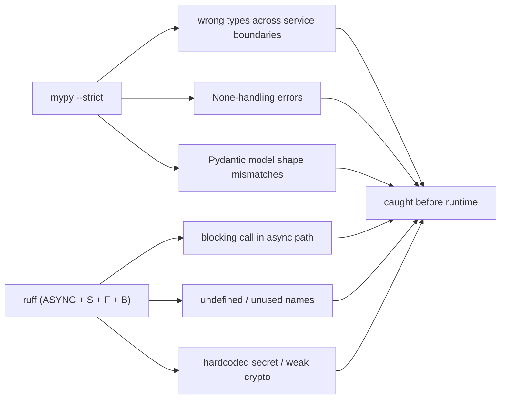

# Static Analysis

Static analysis is the platform's **strongest** verification layer and the
one that compensates most for the absent unit suite. Two tools are
configured in the root `pyproject.toml` and run across all packages and
services.

## Ruff (lint + import-sort + security lints)

```toml
[tool.ruff]
line-length = 100
target-version = "py311"

[tool.ruff.lint]
select = ["E", "F", "I", "B", "UP", "N", "ASYNC", "S", "C4", "RET", "SIM"]
ignore = ["E501", "S101", "B008"]

[tool.ruff.lint.per-file-ignores]
"**/tests/**" = ["S", "ASYNC"]
```

The selected rule families are deliberately broad:

| Code | Family | Why it matters here |
|---|---|---|
| `E`, `F` | pycodestyle / pyflakes | undefined names, unused imports — the classic bug class |
| `I` | isort | deterministic import order across 24 packages/services |
| `B` | flake8-bugbear | likely-bug patterns (mutable defaults, etc.) |
| `UP` | pyupgrade | keep to modern py311 idioms |
| `N` | pep8-naming | consistent naming across the monorepo |
| `ASYNC` | flake8-async | **async correctness** — blocking calls in async code (critical for this codebase) |
| `S` | flake8-bandit | **security lints** — hardcoded secrets, weak crypto, injection sinks |
| `C4`, `RET`, `SIM` | comprehensions / returns / simplify | readability + small correctness wins |

The `ASYNC` and `S` families are the high-value ones for this platform:
`ASYNC` guards the async-everywhere implementation (`10_implementation/
async_implementation.md`), and `S` is a lightweight security gate
(`08_security/dependency_security.md`). `B008` is ignored because FastAPI's
`Depends(...)` in argument defaults is the framework idiom, not the bug
bugbear flags it as.

## Mypy (strict typing)

```toml
[tool.mypy]
python_version = "3.11"
strict = true
ignore_missing_imports = true
plugins = ["pydantic.mypy"]
```

`strict = true` turns on the full strict bundle — no implicit `Any`, no
untyped defs, no untyped calls, strict optional handling, and more. This is
the single most important quality control in the project: in a 24-package
monorepo with no unit tests, **the type checker is the regression net for
signatures and data shapes.**

The `pydantic.mypy` plugin makes mypy understand Pydantic models, so the
many places models are used as request bodies, response shapes, and AI
structured-output schemas (`10_implementation/ai_implementation.md`) are
type-checked end to end. `ignore_missing_imports` accommodates third-party
libraries without stubs.

## What static analysis buys without unit tests



This catches a large fraction of what unit tests catch in a dynamically
typed codebase — type mismatches, None bugs, async misuse, dead code,
obvious security smells. What it cannot catch is **logic that is correctly
typed but wrong**; that is the gap the missing unit suite would fill
(`coverage.md`).

## How it is run (honestly: manually)

There is no pre-commit hook and no CI gate enforcing these. They are run by
hand from the repo root before a change is considered done:

```bash
ruff check .
mypy packages services
```

Wiring these into a pre-commit hook and a CI job is the first item in
`ci_test_automation.md` — it is low-effort and high-value precisely because
the configuration already exists; only the automation is missing.
