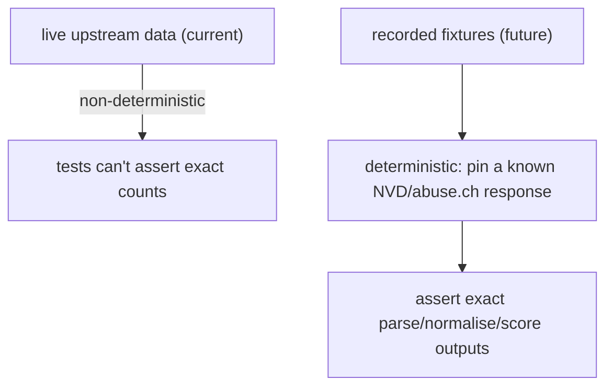

# Test Data and Fixtures

There is no `pytest` fixture layer (no test suite to serve). What plays the
role of test data is a set of **seed scripts** in `infra/bootstrap/` that
populate a fresh stack with realistic data so the platform can be exercised
end to end. These are the de-facto fixtures for the manual E2E and Playwright
layers.

## Seed scripts as fixtures

| Script | Seeds | Used by |
|---|---|---|
| `seed_secrets.py` | RS256 keypair, per-service bootstrap tokens, `LITELLM_MASTER_KEY`, `credentials.env` | the bootstrap dance (mandatory) |
| `set_secrets.py` | individual secret writes | operator credential updates |
| `seed_cmdb_mock.py` | a realistic company profile + assets | dashboard, HIBP, orchestrator context |
| `seed_knowledge_base.py` | baseline intelligence data | populating lists for the walkthrough |

`seed_cmdb_mock.py` is the most fixture-like: the orchestrator's analysis
cycle and the HIBP lookup both read the company profile
(`06_services/cmdb_service`), so a seeded profile is the precondition for the
AI features producing meaningful output. Without it, `/analyze` runs but has
no company context to rank against.

## The "real data" fixture

The platform's most important test data is not seeded at all — it is the
**live upstream data** the ingesters pull on first run: NVD CVEs, abuse.ch
IOCs, MITRE ATT&CK actors, RSS articles, ransomware.live victims. The
verification record (`e2e_testing.md`) cites real volumes observed after
ingestion (e.g. 241 articles, 2028 IOCs, 140+ actors), which is exactly the
data the Playwright walkthrough renders.

This is a double-edged choice:

| Upside | Downside |
|---|---|
| tests exercise real-world data shapes, not idealised mocks | data is non-deterministic — counts differ run to run |
| catches real upstream quirks (defanged IOCs, odd CVE formats) | a feed being down changes what's available to test |
| zero fixture-maintenance burden | not reproducible — can't pin a known dataset |

## What a real fixture layer would add

The future-work design (`16_future_work`) is to **record** representative
upstream responses (the `AvailableServices/ASM/tip/tests/fixtures/` legacy
code shows the pattern — captured `nvd_responses.py`, `misp_responses.py`,
etc.) and replay them, so the source-parsing and normalisation logic can be
asserted deterministically without a live network. That converts the
non-deterministic "real data" fixture into a reproducible one for the
parsing/scoring layer, while keeping live data for the full-stack walkthrough.

## Credentials used in testing

The manual E2E and Playwright layers authenticate with the seeded admin
account (`admin` / `changeme`). This is a deliberately weak default that
`08_security` flags must be rotated after first login; in the test/dev
context it is the known fixture credential that the walkthrough and `curl`
blocks rely on.
