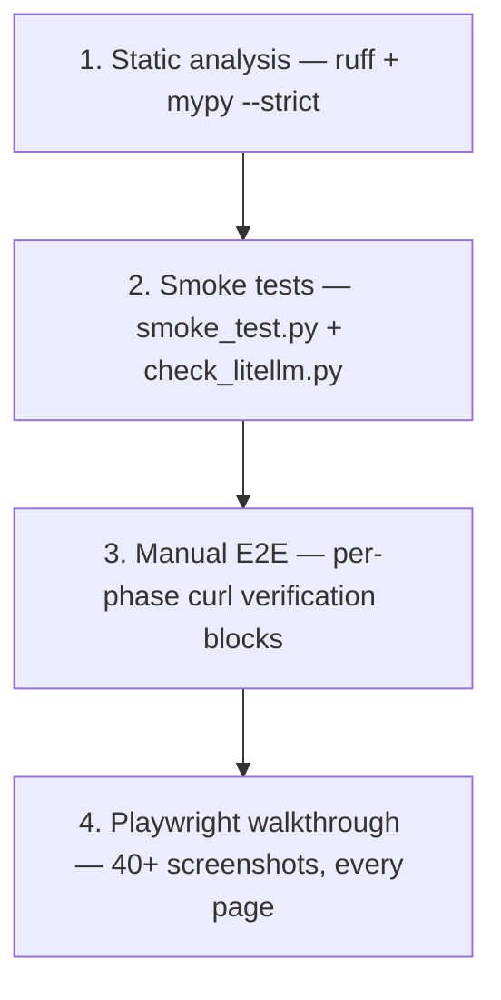

# Testing Strategy

## An honest starting point

This platform does **not** have a conventional automated test suite. There
are no `pytest` unit tests and no integration tests in `services/` or
`packages/`. (The only `test_*.py` files in the tree live under
`AvailableServices/` — legacy code being refactored, not part of the
deployed platform.) Pretending otherwise would be dishonest, and this
chapter documents what verification *actually* exists rather than an
idealised pyramid.

What the platform has instead is a **four-layer verification strategy**
weighted toward static analysis and end-to-end checks:

This is an **inverted test pyramid**: heavy at the E2E/visual end, light at
the unit end. That is the opposite of the textbook ideal, and it is a named
limitation (`15_limitations`), accepted for a single-developer PFE where
correctness was validated by running the real stack against real upstream
data rather than by mocking it.

## Why this shape, honestly

| Driver | Consequence |
|---|---|
| Single developer, fixed timeline | effort went to features + a working stack, not test scaffolding |
| Heavy reliance on live external data | behaviour was validated against real NVD/abuse.ch/feeds, hard to unit-mock meaningfully |
| Strong static typing (mypy --strict) | the type checker catches a large class of errors a unit test otherwise would |
| Fault-tolerant by design (degrade, never crash) | the system tolerates the partial failures tests would assert, observable via `/health/sources` |

None of these *justify* the absence of unit tests as good practice — they
explain the engineering tradeoff and are revisited in `15_limitations` and
`16_future_work`.

## What each layer actually catches

| Layer | Catches | Misses |
|---|---|---|
| Static analysis | type errors, unused/undefined names, async misuse, security lints | logic errors that type-check fine |
| Smoke tests | a service that won't boot or is unreachable; a broken AI chain | wrong-but-200 responses |
| Manual E2E | end-to-end correctness of a feature path | regressions in untouched paths |
| Playwright walkthrough | frontend render failures, broken pages, visual regressions | backend logic the UI doesn't surface |

The honest gap is the diagonal: **logic that type-checks, boots, and renders
but is subtly wrong** is caught only when a human notices. The mitigations
are mypy's strictness and the breadth of the Playwright walkthrough, not a
unit suite.

## Documents in this chapter

| Document | Content |
|---|---|
| `static_analysis.md` | the real ruff + mypy configuration |
| `unit_testing.md` | honest: none present; the most unit-testable code identified |
| `integration_testing.md` | honest: none present; what smoke/manual cover instead |
| `smoke_testing.md` | `smoke_test.py` + `check_litellm.py` |
| `e2e_testing.md` | the manual `curl` verification blocks |
| `playwright_testing.md` | the `walkthrough.py` visual walkthrough |
| `regression_testing.md` | how regressions are actually caught (git + walkthrough) |
| `test_data_and_fixtures.md` | the seed scripts that stand in for fixtures |
| `coverage.md` | an honest coverage assessment |
| `ci_test_automation.md` | honest: no CI; the recommended future pipeline |

The chapter's purpose is to be **useful and truthful** for a reviewer or a
future maintainer: it states the real safety nets, names the real gaps, and
points each gap at the future-work item that would close it.
