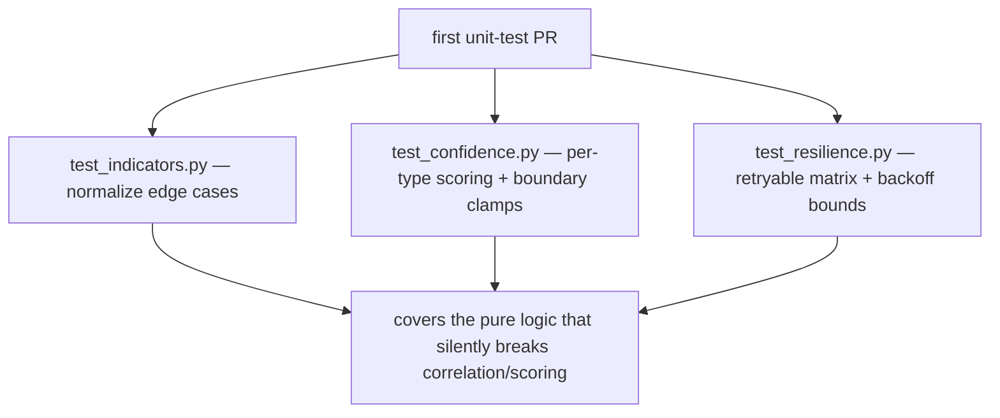

# Unit Testing

## Honest status: no unit suite

There are **no unit tests** in `packages/` or `services/`. This is the most
significant testing gap in the project and is named as such in
`15_limitations`. This document does two honest things: it states the gap,
and it identifies the code that is *most* unit-testable — the natural target
for the first tranche of tests in `16_future_work`.

## Why unit tests are absent

The honest reasons (not justifications):

- single developer on a fixed PFE timeline;
- behaviour was validated against **live** upstream data (NVD, abuse.ch,
  MITRE, RSS), which is awkward to mock meaningfully;
- `mypy --strict` was leaned on as the signature/shape regression net
  (`static_analysis.md`).

## The most unit-testable code (where tests should start)

Several modules are **pure or near-pure functions** with no I/O — they are
the highest-value, lowest-effort unit-test targets and need no fixtures:

| Module | Function(s) | Why ideal for unit tests |
|---|---|---|
| `tip_schemas/indicators.py` | `normalize(type, value)` | pure string→string; many edge cases (defanged domains, IPv6 zones, hash length disambiguation, URL canonicalisation) |
| `tip_schemas/confidence.py` | the scoring formula | pure numeric; deterministic given inputs; per-data-type weight tables |
| `tip_http/resilience.py` | `_is_retryable_status`, backoff math | pure predicates / arithmetic; the retry policy is exact |
| `tip_common/sorting.py` | `resolve_sort` | pure parse + validate |
| `tip_ai/synthesis.py` | note sorting + payload capping | pure list ops (pinned-first, cap 20/10/25) |
| `tip_ai/litellm_client.py` | `_strip_code_fences`, `extract_json` | pure text parsing with known tricky inputs |

These functions have **clear input/output contracts and branchy edge
cases** — exactly what unit tests are best at. For example, `normalize`
should have cases proving `example[.]com`, `example(.)com`, and
`EXAMPLE.com.` all collapse to `example.com`, because that equivalence is
the cross-service join key (`10_implementation/feature_implementation.md`)
and a regression there silently breaks IOC correlation.

## What a first unit-test tranche would look like

These three files alone would cover the functions whose silent failure is
most damaging (indicator equivalence and confidence scoring drive
correlation and ranking) and would run in milliseconds with no external
dependencies.

## What is genuinely hard to unit-test here

Honesty cuts both ways — some of the codebase is legitimately
integration-shaped, not unit-shaped:

- route handlers (need a DB session + app context → integration test);
- the source modules (`app/sources/*`) wrap live HTTP → contract/mocked
  tests, not pure units;
- the AI synthesis path's *end result* depends on a live model → validated
  by structured-output schema validation at runtime, not by unit assertion.

So the realistic target is: **unit-test the pure core, integration-test the
routes, contract-test the sources** — sketched in `integration_testing.md`
and `16_future_work`.
