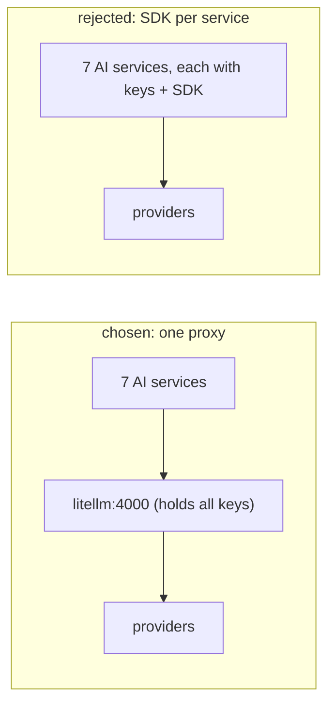

# AI Stack

## Decision: a single LiteLLM proxy, consumed via a thin HTTP client + Pydantic structured output

AI is delivered as **one egress** — a standalone LiteLLM proxy that every
AI-consuming service POSTs OpenAI-format requests to — rather than each
service embedding a provider SDK or an orchestration framework. This document
justifies that against the alternatives.

## Why a proxy (vs per-service provider SDKs)

| Concern | LiteLLM proxy | SDK in each service |
|---|---|---|
| Where provider keys live | one place (the proxy) | duplicated across 7 services |
| Key rotation | restart one container | redeploy 7 services |
| Retry / fallback config | once, in the proxy | reimplemented per service |
| Provider switching | proxy config change | code change everywhere |
| Egress auditability | one egress to allowlist | 7 egress points |

The proxy wins decisively on **secret minimisation and operational
surface**. The compliance requirement that "only the LiteLLM proxy and named
ingester sources make outbound calls" (`01_introduction/stakeholders.md`)
is *enforced* by this design: no service holds a provider key, so no service
can call a provider directly. Rotating `OPENROUTER_API_KEY` is a proxy
restart, not a fleet redeploy. The client's own docstring states these
reasons verbatim (`10_implementation/ai_implementation.md`).

## Why not LangChain / an orchestration framework

| Need | LiteLLM proxy | LangChain |
|---|---|---|
| Call a model, get structured JSON back | direct | wrapped in abstractions |
| Provider fallback | proxy `router_settings.fallbacks` | chain config |
| Footprint / dependency weight | thin HTTP client | large dependency surface |
| Control over the prompt + schema | total (Pydantic) | indirected |

LangChain (and similar) were rejected as **the wrong abstraction level**.
The platform does not need agentic chains, tool-calling graphs, or memory
abstractions — it needs "send this prompt + schema, get back validated
JSON." That is a thin HTTP call plus Pydantic validation
(`generate_structured`), which the platform owns end to end. A heavyweight
framework would add dependency weight and indirection for capabilities the
platform deliberately does not use.

## Why structured output via Pydantic (not free-text parsing)

Every AI result is produced by `generate_structured`: inject the Pydantic
schema's JSON-schema into the prompt, request JSON mode, validate with
`model_validate`, and on failure retry **once** with the error fed back, then
fail (`10_implementation/ai_implementation.md`). This makes AI output a typed
object, not a string to parse — the same Pydantic class that defines the API
response defines the AI contract. The alternative (regex/heuristic parsing of
free text) is brittle and untyped and was never seriously considered.

## Why the smart-model fallback cascade

Provider quotas are real and tight (GitHub Models: `gpt-5-chat` 12/day + 1
concurrent; `gpt-4.1` ~50/day; `gpt-4o` 2 concurrent — observed operating
characteristics). A single model is therefore unreliable for a platform that
runs scheduled AI cycles. The defence is **defence in depth**: a client-side
`_SMART_MODEL_DEFAULTS` cascade *and* the proxy's own server-side fallback
config, so a quota hit on one model transparently retries the next.

This is also why flowviz uses `github/gpt-4.1` as primary rather than Sonnet:
Sonnet via GitHub Models has no key in the vault and would 401. The cascade
plus correct primary selection is what keeps AI features working through
daily quota exhaustion (`10_implementation/ai_implementation.md`).

## Why AI is kept off the ingest hot path

A first-class architectural rule (`AI reads processed data only`): ingestion
jobs never call the LLM. This decouples data freshness from AI availability —
when the provider is down or quota-exhausted, **ingestion keeps running** and
only the synthesis layer degrades. The proxy design supports this cleanly:
ingesters simply never build a `LiteLLMClient`.

## Consequences accepted

| Consequence | Mitigation |
|---|---|
| The proxy is a single point of failure for AI | AI is non-critical (off the hot path); failure degrades synthesis only |
| Quotas can still exhaust all models | cache-first insights (`10_implementation/caching_implementation.md`) avoid re-billing; cascade spreads load |
| Provider-specific features abstracted away | acceptable — the platform needs only chat-completions + JSON mode |
