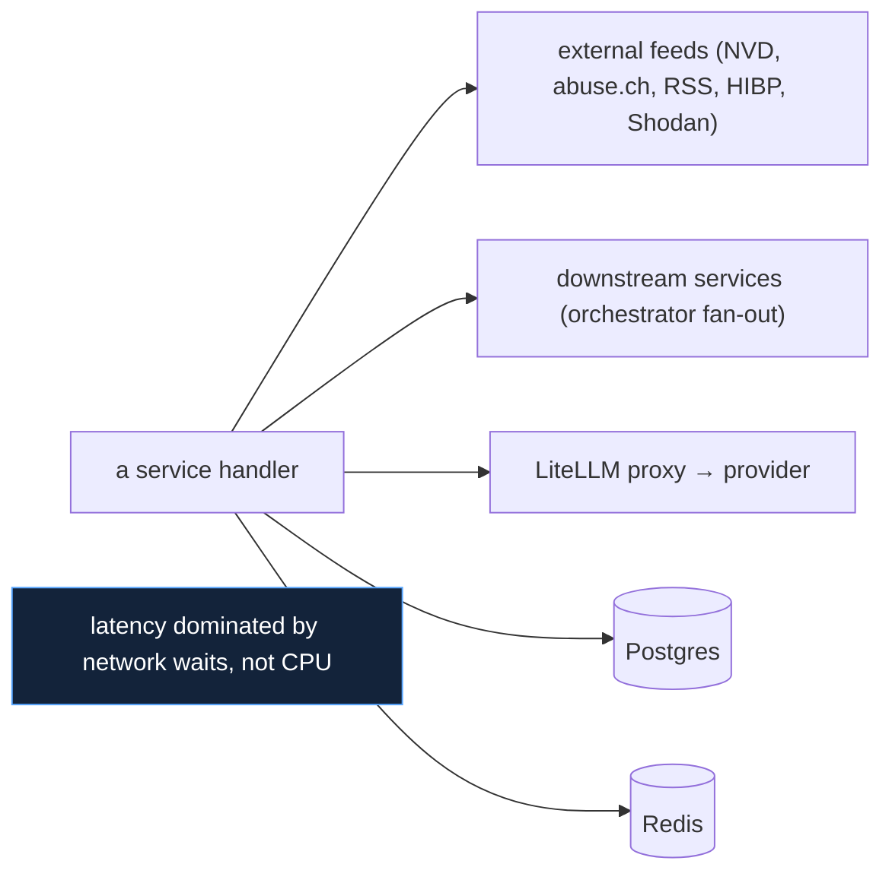

# Async Stack

## Decision: async everywhere (asyncio / ASGI / asyncpg / httpx)

The platform runs on a single async runtime from the web layer to the
database to outbound HTTP. This document justifies *why async* for this
workload and where the deliberate exceptions are.

## The workload is I/O-bound — the deciding fact

Every expensive thing the platform does is **waiting on someone else**:

For an I/O-bound workload, an async event loop serves far more concurrent
in-flight operations per process than thread-per-request, because a coroutine
awaiting a socket costs almost nothing while a blocked thread costs a full
stack. This is the textbook case *for* asyncio, and it is why the language's
GIL (a CPU-parallelism limit) is largely irrelevant here — there is little
CPU work to parallelise.

## Why this beat the alternatives

| Alternative | Why not |
|---|---|
| Sync Flask/Django + threads | a blocked thread per external call; the orchestrator's 6-way fan-out alone would tie up 6 threads per request |
| Go goroutines | excellent concurrency, but loses the Python CTI/AI ecosystem (`backend_stack.md`) for a workload that is wait-bound, not compute-bound |
| Node async | comparable runtime fit, but worse domain-library ecosystem |

The async-Python choice keeps the rich domain ecosystem **and** gets the
concurrency model the workload wants.

## The three primitives (and one anti-pattern)

The async model is used precisely (`10_implementation/async_implementation.md`):

| Primitive | For | Example |
|---|---|---|
| `asyncio.gather(return_exceptions=True)` | independent I/O fan-out | source ingestion, investigation, dashboard aggregation |
| FastAPI `BackgroundTasks` | work that outlives the response | `/analyze`, KEV backfill, CMDB→ASM sync |
| `ThreadPoolExecutor` | blocking sync libraries | DNS, `python-whois` |
| **serialized awaits (NOT gather)** | the AI legs | provider concurrency cap = 1–2 |

The AI exception is the instructive one: async makes parallelism *easy*,
which is exactly why it had to be *deliberately suppressed* for AI calls when
GitHub Models' concurrency cap was tripped. Choosing async means owning the
discipline of when **not** to parallelise.

## Why fault tolerance is natural in this model

The async fan-out model and the fault-tolerance model reinforce each other.
`asyncio.gather(..., return_exceptions=True)` turns one failed source into a
result entry instead of a cancelled sibling, which is precisely the
"partial success is success" rule (`10_implementation/fault_tolerance.md`).
A thread-based model could do this too, but less cheaply and less naturally —
the async primitive *is* the fault-isolation primitive.

## The two blocking-library exceptions

DNS resolution and `python-whois` are synchronous C-backed libraries with no
async equivalent worth adopting. Rather than block the loop, both are pushed
to a `ThreadPoolExecutor` via `run_in_executor` (domainwatch and
indicator-intel). This is the correct async-world pattern for unavoidable
sync code, and it is documented per service so the exception is visible.

## One sync engine, on purpose

APScheduler 3.x's `SQLAlchemyJobStore` is sync-only, so the scheduler runs a
**second, synchronous** psycopg2 engine just for the job store, alongside its
async engine for everything else (`10_implementation/
database_implementation.md`). APScheduler 4 is async-native but still beta;
the small dual-engine wart was accepted over depending on a beta. This is the
one place the "async everywhere" rule bends, and it bends knowingly.

## Consequences accepted

| Consequence | Mitigation |
|---|---|
| Async code is easy to misuse (blocking calls sneak in) | ruff's `ASYNC` lint family guards against it (`11_testing/static_analysis.md`) |
| No CPU parallelism within a process | workload is I/O-bound; scale by containers if needed |
| Beta-avoidance leaves one sync engine | isolated to the scheduler; documented |
