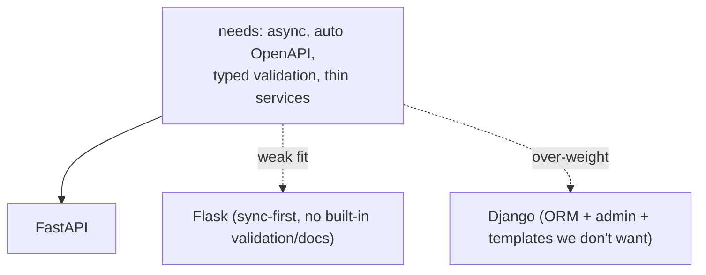

# Backend Stack

## Decision: Python 3.11 + FastAPI + Pydantic v2

The 15 services are Python 3.11, built on FastAPI, with Pydantic v2 for
validation and serialisation. This document justifies that stack against the
alternatives.

## Why Python (vs Go, Node)

| Criterion | Python | Go | Node/TS |
|---|---|---|---|
| CTI / data ecosystem | excellent (feedparser, stix2, python-whois, dnspython) | thin | moderate |
| AI / LLM tooling | first-class | thin | good |
| Async I/O | mature (asyncio) | excellent (goroutines) | excellent |
| Developer velocity (solo, fixed timeline) | high | medium | high |
| Static safety | mypy --strict (opt-in) | compiler (built-in) | tsc |

The deciding factor is the **domain ecosystem**. A threat-intelligence
platform leans heavily on libraries that are richest in Python: MITRE
`stix2` for ATT&CK ingestion, `feedparser` for RSS/Atom, `python-whois` and
`dnspython` for investigation, plus the entire LLM tooling landscape. Go
would give better raw concurrency and a compiler, but re-implementing STIX
parsing and feed handling would have cost more than Go's runtime advantages
returned for an I/O-bound workload. The latency budget is dominated by
*external* calls, not CPU, so Go's speed edge is largely irrelevant here
(`async_stack.md`).

## Why FastAPI (vs Flask, Django)

| Need | FastAPI | Flask | Django |
|---|---|---|---|
| Native async (ASGI) | yes | bolt-on | partial (ASGI-ish) |
| Automatic OpenAPI from type hints | yes | extension | DRF, heavier |
| Request/response validation | Pydantic, built-in | manual / marshmallow | DRF serializers |
| Footprint for a thin service | minimal | minimal | heavy (batteries included) |
| Dependency injection | built-in (`Depends`) | manual | manual |

FastAPI wins on every axis that matters for this design:

- **Async-native** — the whole point of the stack (`async_stack.md`); Flask
  is sync-first and Django's async story is still partial.
- **OpenAPI for free** — each service publishes `/docs` and `/openapi.json`
  with no extra code, which is the platform's API contract
  (`10_implementation/api_implementation.md`). With 15 services and ~150
  endpoints, hand-maintaining API docs was a non-starter.
- **Pydantic everywhere** — request bodies, response models, **and** AI
  structured-output schemas are the same Pydantic classes
  (`10_implementation/ai_implementation.md`). One type system does triple
  duty.
- **`Depends` injection** — the `get_session` / `require_permission` pattern
  that gives every service the same shape (`10_implementation/
  backend_implementation.md`) is FastAPI's DI, not hand-rolled middleware.

Django was rejected as fundamentally the wrong shape: its value is the ORM +
admin + template + auth bundle, almost none of which this platform wants
(schema-per-service rules out a single shared ORM; auth is a dedicated
service; there are no server-rendered templates — the frontend is Next.js).
Flask was rejected because everything FastAPI gives natively would have to
be assembled from extensions, reproducing FastAPI poorly.

## Why Pydantic v2 specifically

Pydantic v2's Rust core makes validation fast enough to sit on every request
and every AI response without being a bottleneck. The platform exploits one
capability heavily: `model_json_schema()` feeds the model's JSON-schema into
the AI prompt, and `model_validate()` enforces the response shape on the way
back — structured-output enforcement is *the same class* used for the API
(`10_implementation/ai_implementation.md`). marshmallow and plain
dataclasses cannot do this dual role.

## The shared-skeleton payoff

Because the stack is uniform, the `tip_common.create_service_app` factory can
encode the entire service shape once — logging, correlation IDs, error
envelope, health, lifespan — and all 15 services inherit it
(`10_implementation/implementation_overview.md`). A different framework per
service would have made that impossible. The uniformity *is* the
architecture's comprehensibility.

## Consequences accepted

| Consequence | Mitigation |
|---|---|
| Python's GIL limits CPU parallelism | workload is I/O-bound; async + multiple containers, not threads |
| Dynamic typing risk | `mypy --strict` across the monorepo (`11_testing/static_analysis.md`) |
| Per-service dependency duplication | uv path-deps + per-service images (`containerization_stack.md`) |
