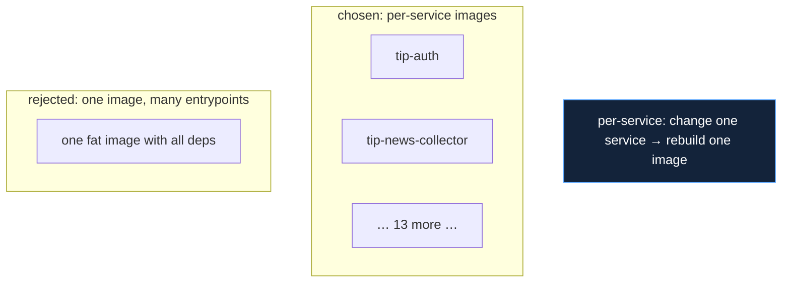

# Containerization Stack

## Decision: Docker, per-service images, uv path-dependencies, special base images where needed

Every service is its own Docker image, built with `uv` installing the shared
`packages/tip_*` as path dependencies. This document justifies the
containerization choices; the operational mechanics are in
`09_devops/dockerization.md`.

## Why per-service images (vs one monolithic image)



| Property | Per-service images | Monolithic image |
|---|---|---|
| Dependency isolation | each service's deps only | all deps collide in one image |
| Rebuild blast radius | one service | the whole stack |
| Image size per service | light | heavy (everything) |
| Independent deploy | yes (`up -d --force-recreate <svc>`) | no |

Per-service images are the **enabler for fast incremental deploys**: a
one-service change rebuilds one image and recreates one container, leaving
the other 14 running (`09_devops/deployment_strategies.md`). They also give
true dependency isolation — threat-actors needs `stix2`, news-collector needs
`feedparser`, domainwatch needs Playwright; bundling all of those into one
image would bloat every service with dependencies it does not use. The
accepted cost is more images to build, paid down by layer caching.

## Why uv + path dependencies (vs pip, Poetry, a workspace)

Shared logic lives in nine `packages/tip_*` libraries, declared by each
service as path dependencies:

```toml
tip-common = { path = "../../packages/tip_common" }
```

| Choice | Verdict |
|---|---|
| **uv path-deps** | **chosen — fast installs, clean per-service builds, layer-cache friendly** |
| plain pip | slower; no lock discipline |
| Poetry | heavier; workspace model fights per-service Docker builds |
| editable monorepo workspace | rejected — couples builds; one image would need the whole tree |

uv is chosen for **speed and clean Docker builds**. Path dependencies give a
single source of truth for shared logic (`tip_common`, `tip_http`, etc.)
without publishing internal packages to a registry, while each service's
Dockerfile still gets an independent, layer-cacheable build. This is the
"single source of truth for shared logic" the developer stakeholder requires
(`01_introduction/stakeholders.md`) without sacrificing per-service build
isolation.

## The layer-caching strategy

The Dockerfile order is deliberate: copy `packages/` and install deps
**before** copying the service code, so a service-code change does not
invalidate the slow dependency-install layer (`09_devops/dockerization.md`).
This is what makes incremental rebuilds fast enough to deploy one changed
service in seconds.

## Why special base images where needed

Three images deviate from the `python:3.11-slim` baseline, each for a
concrete reason:

| Image | Base | Why |
|---|---|---|
| domainwatch | `mcr.microsoft.com/playwright/python` | ships browser binaries — avoids fragile runtime browser installs |
| litellm | `ghcr.io/berriai/litellm` | the official AI-gateway image |
| alembic-init | python-slim + all packages | must import every service's `app.models` to migrate |

Using the official Playwright base for domainwatch was a direct fix for the
otherwise-fragile task of installing a headless browser into a slim image
(`06_services/domainwatch_service`). The alembic-init image is intentionally
"fat" — it installs every package so each service's `env.py` can import its
models — a one-shot cost paid once at migration time (`09_devops/ci_cd.md`).

## Why bind-mounts in dev only

The dev overlay bind-mounts `packages/` so the author can edit shared
libraries and see changes without rebuilding; production bakes code into the
image (`10_implementation/deployment_models.md`). This keeps the dev loop
fast while guaranteeing production images are self-contained and reproducible.

## Consequences accepted

| Consequence | Mitigation |
|---|---|
| More images to build than a monolith | layer caching + per-service rebuild keep it fast |
| Fat alembic-init image (~500MB) | one-shot container; acceptable |
| Shared-package change rebuilds many images | the blast radius of `tip_*`; guarded by mypy (`11_testing`) |
