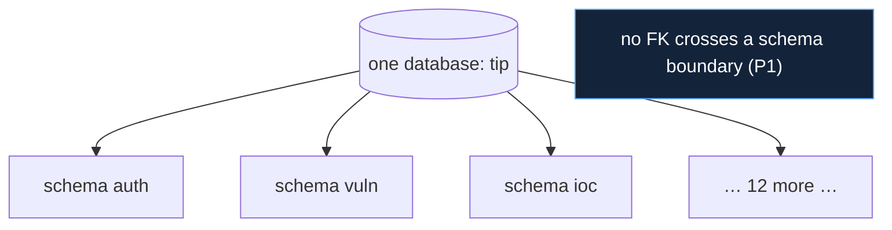
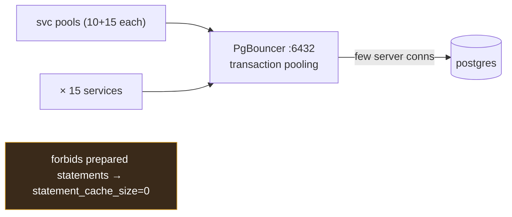

# Database Stack

## Decision: PostgreSQL (schema-per-service) + asyncpg + SQLAlchemy 2.x async + PgBouncer + Alembic

The data layer is one PostgreSQL database with a schema per service, accessed
asynchronously through PgBouncer. Every element of that sentence is a
decision justified below.

## Why PostgreSQL (vs MySQL, MongoDB)

| Need | PostgreSQL | MySQL | MongoDB |
|---|---|---|---|
| JSONB for provider-shaped data + indexable | excellent | weaker JSON | native doc, but no relational |
| Schemas (namespacing within one DB) | yes | databases-as-schemas | n/a |
| Strong relational + array/text[] types | yes | partial | no |
| Full-text search | built-in | basic | separate |

PostgreSQL is chosen because the data is **both relational and
semi-structured**. The platform stores normalised relational columns for the
fields it queries and indexes (CVE id, indicator value, severity) *and*
`JSONB` for the full upstream record (`raw`, `payload`, `details`,
`confidence_inputs`) so nothing is lost and re-processing needs no re-fetch
(`07_database/optimization.md`). MongoDB would handle the JSON but lose the
relational joins and constraints; MySQL's JSON and schema story are both
weaker. Postgres `text[]`, JSONB indexing, and full-text search are all used
directly.

## Why schema-per-service (vs database-per-service, shared schema)

| Model | Isolation | Operational cost | Cross-service query |
|---|---|---|---|
| Shared schema | none (services collide) | low | trivial but forbidden |
| **Schema-per-service** | **logical, per service** | **one DB to run/back up** | **API-only (by design)** |
| Database-per-service | strongest | 15 DBs to operate | API-only |

Schema-per-service is the **middle path that matches the principles**: it
gives each service its own namespace (no service touches another's tables,
`P1`) while keeping a single database to operate, back up, and connection-pool
on a single host. Database-per-service would multiply operational overhead
15× for isolation the schema boundary already provides. The key discipline —
**no foreign keys across schemas** — means a service can later be lifted to
its own database with only a connection-string change, so the cheaper model
does not foreclose the stronger one (`12_.../infrastructure_stack.md`,
`16_future_work`).

## Why asyncpg + SQLAlchemy 2.x async (vs psycopg2, raw SQL, Tortoise)

The backend is async end-to-end, so the driver must be async. asyncpg is the
fastest async Postgres driver; SQLAlchemy 2.x's async API gives a typed ORM
on top without giving up control.

| Choice | Verdict |
|---|---|
| psycopg2 (sync) | rejected — would block the event loop (kept *only* for APScheduler's sync job store) |
| raw asyncpg, no ORM | rejected — loses model typing + Alembic integration |
| Tortoise ORM | rejected — smaller ecosystem, weaker migration story |
| **asyncpg + SQLAlchemy 2.x async** | **chosen — fast driver + typed models + Alembic** |

## Why PgBouncer (transaction pooling)

This is the non-obvious but load-bearing choice. Fifteen services, each with
its own connection pool, would exhaust Postgres's connection limit. PgBouncer
in **transaction-pooling** mode multiplexes many client connections onto few
server connections.

The cost is strict: **transaction pooling forbids prepared statements**,
because a client is not guaranteed the same backend across calls. The
implementation pays it explicitly with `statement_cache_size=0` and
`prepared_statement_cache_size=0` on every engine
(`10_implementation/database_implementation.md`). This single constraint
ripples through the whole data layer and is the most important
environment-coupled fact about it.

## Why Alembic, per-service

Each service owns its migrations under `services/<name>/alembic/`, run by the
one-shot `alembic-init` container, each with its own `version_table_schema`
so the 15 histories never collide (`07_database/migrations.md`). SQLAlchemy
`create_all` was rejected (no versioning, no downgrade); Django migrations
were never on the table (no Django). Per-service Alembic keeps migrations
co-located with the models they migrate, consistent with the vertical-slice
design.

## Consequences accepted

| Consequence | Mitigation |
|---|---|
| No prepared statements (PgBouncer) | engine configured for it; correctness over micro-perf |
| One DB is a single failure domain | matches the single-host deployment; per-schema isolation eases future split |
| JSONB can hide unindexed access patterns | the queried fields are promoted to real columns + indexed (`07_database/indexing_strategy.md`) |
