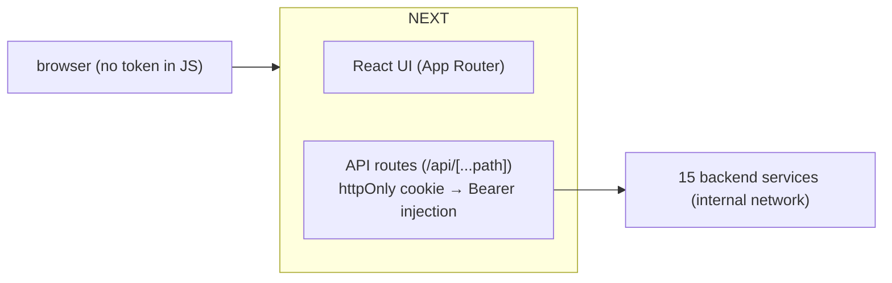
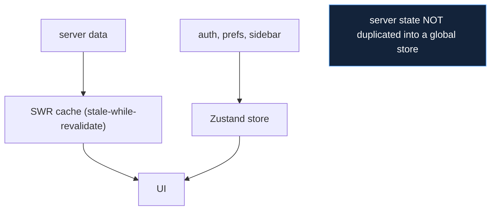

# Frontend Stack

## Decision: Next.js 16 + Ant Design 5 + Tailwind + SWR + Zustand + ReactFlow

The frontend is a single Next.js application that is both the user interface
and the security boundary (the BFF). This document justifies each piece.

## Why Next.js (vs a plain SPA, Remix)

The decisive factor is the **BFF requirement**. After the inter-service auth
simplification, the platform needs exactly one place that holds the user's
JWT, validates the edge, and forwards to backend services. Next.js API
routes provide that server-side layer **in the same deployable** as the UI.

| Need | Next.js | Plain SPA (Vite/CRA) | Remix |
|---|---|---|---|
| Server-side BFF in the same app | yes (API routes) | no (needs separate server) | yes (loaders/actions) |
| httpOnly-cookie auth without exposing token to JS | yes | hard | yes |
| SSR for first paint + client transitions | yes | no (CSR only) | yes |
| Ecosystem / maturity | very high | high | growing |

A plain SPA was rejected because it would force a **separate gateway
process** to hold the token and proxy requests — exactly what the Next.js
BFF does for free, in-process. Remix was a genuine contender (its loader
model is elegant) but Next.js's larger ecosystem and the team's familiarity
made it the lower-risk choice. The App Router gives SSR for initial load
speed (Karim opening the dashboard) plus SPA-like client transitions
(Yassine pivoting between IOC views).

## Why the BFF pattern matters

The BFF (`10_implementation/frontend_implementation.md`) delivers three
security properties that shaped the whole frontend choice:

- the **JWT lives in an httpOnly cookie**, never in JS-reachable storage;
- **no CORS** is needed on any backend service — the browser only talks to
  the Next.js origin;
- a single `SERVICE_MAP` is the only place backend topology is encoded.

This is only clean because Next.js runs server code next to the UI. It is
the single strongest reason for the framework choice.

## Why Ant Design 5 + Tailwind (vs MUI, Chakra)

| Need | Ant Design | MUI | Chakra |
|---|---|---|---|
| Enterprise data tables / forms / drawers | excellent (built-in) | good | weaker |
| Dark theme via tokens | `ConfigProvider` algorithm | possible | possible |
| Density suited to a SOC console | high | medium | low |

A threat-intelligence console is **table-and-form-heavy** — long IOC lists,
CVE tables, actor profiles, policy editors. Ant Design ships
enterprise-grade tables, filters, drawers, and modals out of the box, which
is precisely the component set this UI needs. Tailwind sits alongside for
custom layout and the dark cybersecurity skin on top of Ant's tokens. The
accepted cost is bundle size (~200KB gzipped), acceptable for an internal
intranet console, not a public site.

## Why SWR + Zustand (not Redux)

The deliberate split: **SWR owns server state, Zustand owns the little
client state.** SWR's stale-while-revalidate gives instant renders from
cache plus background refresh, and its `refetchInterval` drives the live
dashboard (30s) and `/me` poll (15s). Redux was rejected as overkill — there
is no complex client-side state machine to justify its boilerplate, and
mixing server data into a Redux store would duplicate what SWR already caches
correctly. Zustand handles the genuinely-global bits (auth, preferences,
sidebar) with almost no ceremony.

## Why ReactFlow + dagre (attack flows)

Attack flows are directed ATT&CK graphs (`{nodes, edges}` from flowviz).
ReactFlow renders interactive node/edge graphs and dagre auto-lays-them-out
hierarchically. This replaced an earlier "stacked cards" rendering that did
not convey the chain structure. Hand-rolling graph layout in D3 was rejected
as disproportionate effort for a feature ReactFlow delivers directly
(`10_implementation/frontend_implementation.md`). It is dynamically imported
so its ~150KB only loads on pages that render flows.

## Consequences accepted

| Consequence | Note |
|---|---|
| Ant Design bundle size | acceptable for an internal console; tree-shaking helps |
| Frontend types maintained by hand vs OpenAPI | drift possible; caught by the Playwright walkthrough (`11_testing`) |
| No SSR data-fetching for most pages | intentional — most pages are client-fetched via SWR for the SPA feel |
