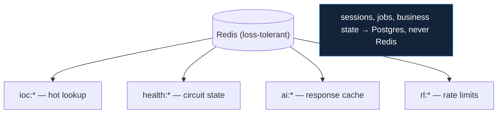

# Infrastructure Stack

## Decision: Docker Compose on a single host, with Redis as the only cache and APScheduler as the only scheduler

The runtime infrastructure is intentionally modest: one host, Docker
Compose, PostgreSQL + PgBouncer + Redis, a LiteLLM proxy, and a central
scheduler. This document justifies the infrastructure-level choices not
already covered in `database_stack.md` and `ai_stack.md`.

## Why Docker Compose (vs Kubernetes)

| Factor | Compose | Kubernetes |
|---|---|---|
| Target | one host | a cluster |
| Operator | one engineer, `make up` | a platform team |
| Bring-up ordering | `depends_on` conditions | init-containers + probes |
| Operational surface | one YAML + one CLI | API server, etcd, kubelets, CNI |

Kubernetes solves problems this deployment does not have (multi-node
scheduling, autoscaling, rolling fleet upgrades) at a cost it cannot
justify (a platform team, a control plane). For a 15-service stack a bank's
existing ops team runs on one host, Compose is the right altitude: the entire
runbook is `make seed && make migrate && make up`
(`09_devops/orchestration.md`). Kubernetes is the documented migration path
*if* multi-host HA becomes a requirement (`16_future_work`) — and the
schema-per-service design keeps that path open.

## Why Redis as cache (vs Memcached, in-process)

| Need | Redis | Memcached | In-process |
|---|---|---|---|
| Shared across service instances | yes | yes | no |
| Data structures beyond strings (TTL, incr) | yes | limited | n/a |
| Loss-tolerant by intent | yes | yes | per-process |

Redis is chosen for the hot-path IOC lookup, the circuit-breaker state, the
AI response cache, and rate-limit counters (`10_implementation/
caching_implementation.md`). The governing rule — **only loss-tolerant data
in Redis; it can be flushed at any time** (`G6`) — means the cache never
holds business state, so even a total Redis loss costs only a repopulation
from Postgres. In-process caching was rejected because the circuit-breaker
and rate-limit state must be shared, not per-process. Memcached was rejected
because Redis's TTL + incr + structured values are used directly.

## Why APScheduler (vs Celery, cron, Temporal)

The platform needs **one owner of all recurring jobs** with a queryable run
history and on-demand triggers — not a distributed task queue.

| Option | Verdict |
|---|---|
| **APScheduler 3.x** | **chosen — in-process scheduler, Postgres job store, fits a single scheduler service** |
| Celery beat | rejected — needs a broker + workers; distributed-queue weight this design doesn't need |
| OS cron | rejected — no run history, no API triggers, no watchdog, opaque failures |
| Temporal | rejected — a workflow engine, far beyond recurring HTTP triggers |

APScheduler runs inside the dedicated scheduler service, persists jobs in a
Postgres job store, and exposes triggers + run history over HTTP
(`06_services/scheduler_service`). Its one wart — the job store is sync-only,
forcing a second psycopg2 engine — is accepted over adopting beta APScheduler
4 (`async_stack.md`). Celery's broker + worker topology would add
infrastructure for a problem (12 periodic HTTP calls + a watchdog) that does
not warrant it.

## Why a central scheduler at all (vs per-service timers)

The legacy services being refactored each had their *own* embedded
scheduler. Consolidating into one service was a deliberate choice: it gives a
single place to see what runs when, a single run-history table, a watchdog
that catches stale jobs, and on-demand triggers — versus 15 opaque internal
timers (`04_solution_design`). The scheduler ↔ service contract (fast=200,
slow=202+callback) is the clean interface that replaced them
(`10_implementation/api_implementation.md`).

## The single-host model and its enabler

The whole stack — ~20 containers — runs on one mid-range Linux host, with
**only the frontend port published** (`10_implementation/deployment_models.md`).
This is appropriate for one finance-enterprise tenant with a SOC-tool
workload (bursty ingest, low-volume reads). The schema-per-service boundary
is the explicit enabler for a future multi-host split: because no service
shares another's tables and all cross-service flow is HTTP, a hot service can
move to its own host with a connection-string and URL change.

## Consequences accepted

| Consequence | Mitigation |
|---|---|
| Single host = single failure domain | matches scope; `restart: unless-stopped` survives reboot; HA is future work |
| No autoscaling | workload fits one host; scale by container/host later |
| Redis loss flushes cache | by design loss-tolerant; repopulates from Postgres |
