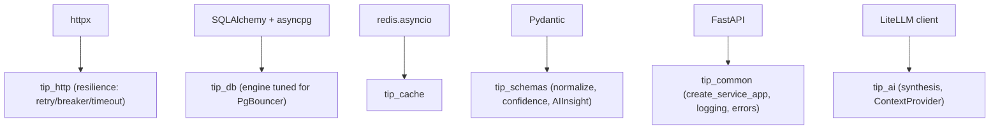

# Library Rationale (consolidated)

This document consolidates the head-to-head library decisions in one place
for quick reference. Each row states the choice, the rejected alternatives,
and the one-line reason. The longer arguments live in the per-stack
documents; this is the index.

## Decision table

| Concern | Chosen | Rejected | One-line reason |
|---|---|---|---|
| Web framework | FastAPI | Flask, Django | async-native + auto OpenAPI + Pydantic DI (`backend_stack.md`) |
| Validation | Pydantic v2 | marshmallow, dataclasses | one type system for API **and** AI structured output |
| HTTP client | httpx | requests, aiohttp | async + sync API, HTTP/2, timeouts; basis of `tip_http` |
| DB driver | asyncpg | psycopg2 (async use) | fastest async Postgres driver |
| ORM | SQLAlchemy 2.x async | Tortoise, raw SQL | typed models + Alembic, async support |
| Pooling | PgBouncer | big per-service pools | multiplex 15 services onto few backends |
| Migrations | Alembic | create_all | versioned, downgradable, per-service histories |
| Cache client | redis.asyncio (via `tip_cache`) | aioredis (deprecated) | maintained, async, in redis-py core |
| Scheduler | APScheduler 3.x | Celery, cron, Temporal | single in-process scheduler + Postgres job store |
| AI gateway | LiteLLM proxy | provider SDKs, LangChain | one egress, centralised keys + fallback |
| Feeds | feedparser | hand-rolled XML | battle-tested RSS/Atom across messy feeds |
| ATT&CK ingest | stix2 | manual JSON parsing | official MITRE STIX object model |
| Investigation | python-whois, dnspython | shelling out to `whois`/`dig` | in-process, typed, testable |
| HTML→text | readability-lxml + bs4 | naive strip | article extraction quality |
| Password hashing | argon2-cffi (argon2id) | bcrypt, pbkdf2 | memory-hard, current OWASP recommendation |
| Crypto / vault | cryptography (Fernet) | hand-rolled AES | authenticated symmetric encryption, vetted |
| JWT | RS256 via PyJWT/jose | HS256 | asymmetric — services verify with the public key only |
| Frontend framework | Next.js 16 | SPA, Remix | in-app BFF for httpOnly-cookie auth (`frontend_stack.md`) |
| UI kit | Ant Design 5 + Tailwind | MUI, Chakra | enterprise tables/forms for a SOC console |
| Data fetching | SWR | TanStack Query, RTK Query | stale-while-revalidate; same team as Next.js |
| Client state | Zustand | Redux | minimal global state; SWR owns server state |
| Graph rendering | ReactFlow + dagre | D3, vis.js | ready-made interactive node/edge graph |
| Packaging | uv (path deps) | pip, Poetry | fast, clean per-service Docker builds |

## The cross-cutting libraries that became `packages/tip_*`

Several choices were elevated into shared libraries so the decision is made
**once** and inherited by all 15 services:

The reason this matters: a library choice here is not 15 independent
adoptions but one. When `tip_http` wraps httpx with the retry/circuit-breaker
policy, every service gets identical resilience for free
(`10_implementation/fault_tolerance.md`). That is the leverage of choosing
once and sharing.

## Decision philosophy in three rules

The table above is consistent because three rules drove every choice:

1. **Prefer the async-native option** so the stack composes on one event loop
   (`async_stack.md`).
2. **Prefer the library that does one thing well** over a framework that does
   many — LiteLLM proxy over LangChain, SWR over a state framework,
   APScheduler over Celery. The platform's complexity is in its *domain*, not
   in needing heavyweight infrastructure abstractions.
3. **Prefer libraries with a strong domain pedigree** — `stix2` for ATT&CK,
   `feedparser` for feeds, `argon2-cffi` for hashing — because reimplementing
   vetted domain logic is risk without reward.

Where a choice has a known wart (psycopg2 alongside asyncpg for APScheduler;
hand-maintained frontend types vs OpenAPI), it is documented in the relevant
stack file and carried in `15_limitations` rather than hidden.
