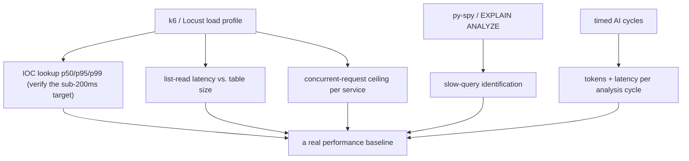

# Benchmarks

## The honest headline: there is no benchmark suite

No formal benchmark was run against this platform. There is **no load test,
no latency histogram, no throughput measurement, no `EXPLAIN ANALYZE`
report, no profiling capture** in the repository. This document exists to say
that plainly and to record the quantitative facts that *were* observed, each
clearly labelled, so that nothing in this chapter can be mistaken for a
measured distribution it is not.

Publishing invented numbers (p50/p95 latencies, requests-per-second) would be
fabrication and is deliberately avoided.

## What was actually observed (measured, point-in-time)

These are real observations from the running deployment, but each is a
**single point-in-time data point**, not a benchmark:

| Observation | Value | Context |
|---|---|---|
| NVD full CVE backfill (no API key) | ~90 min | bounded by NVD's ~5 req/30s limit |
| KEV backfill overlap climb | 12 → 22 → 47 → … toward ~1500 | progress observed during backfill |
| `/ask` "tell me about Lazarus" | 1355-char substantive answer | one query, not in local DB |
| Dorking `example.com` (no Google key) | DuckDuckGo backend, 6 findings | one query |
| Ingested data volumes | ~241 articles, ~2028 IOCs, ~140 actors | a snapshot of the live DB |

These confirm the system *works at realistic scale* — it ingested thousands
of IOCs and answered substantive AI queries — but they do not characterise
latency or throughput under load.

## What was configured (not measured)

The values that *look* like performance numbers are configuration, not
measurements:

| Value | Source | Nature |
|---|---|---|
| sub-200ms IOC lookup | design target | a goal, not a measured latency |
| pool 10 + 15 overflow, 20s timeout, 300s recycle | engine config | tuning inputs |
| cache TTLs (10m / 1h / 60s / 24h) | cache config | policy, not throughput |
| retry 3× / 1s base / ×2 / ±25% | resilience config | policy |
| AI provider quotas | observed provider behaviour | external limits |

## Why no benchmark was run (honest)

| Reason | |
|---|---|
| Scope | single-developer PFE; effort went to building 15 services + a frontend |
| Workload | low-volume internal SOC tool — not a throughput-sensitive public service |
| Validation approach | correctness was proven by running the real stack on real data, not by load testing |

None of these make the absence ideal — they explain it. The gap is carried in
`15_limitations`.

## What a real benchmark effort would measure

The most valuable single measurement would be to **verify the sub-200ms IOC
lookup target** under realistic concurrency — it is the one number the whole
hot-path design is justified by, and it is currently a target, not a result.
Establishing this baseline is a concrete, well-scoped future-work item
(`16_future_work`); the instrumentation to support it (per-call `duration_ms`
logging) already exists (`09_devops/observability.md`), so the data is
capturable — it simply has not been captured and analysed.

## Bottom line

The platform has **operational evidence it works** (real data volumes, real
AI answers) and **no performance benchmark**. This chapter reports the former
honestly and refuses to invent the latter.
