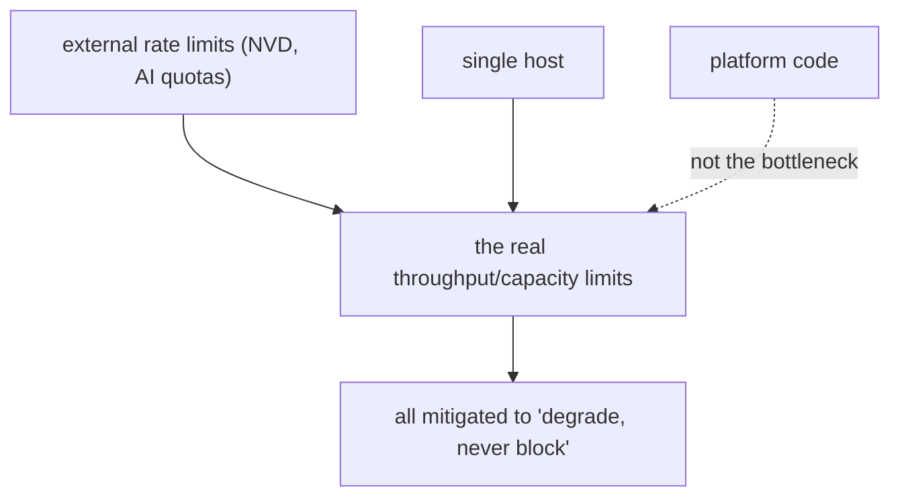

# Bottlenecks

An honest account of where the platform is slow or capacity-limited. The
recurring theme: **the real bottlenecks are external dependencies and the
single-host deployment, not the platform's own code.**

## Bottleneck 1 — NVD rate limit without an API key (throughput)

| | |
|---|---|
| Symptom | full CVE backfill takes ~90 minutes **[measured]** |
| Cause | NVD allows ~5 requests / 30s without a key (50 with one) |
| Where | `vuln-intel` first-boot / KEV backfill |
| Mitigation | incremental pulls after backfill; backfill runs in `BackgroundTasks`, not blocking; an `NVD_API_KEY` (if provided) lifts the limit 10× |
| Verdict | external rate limit, not a platform inefficiency |

This is the clearest measured performance fact in the project and it is an
*upstream* constraint. The platform's job is to make it non-blocking (which
it does — backfill is a background task that streams results in) rather than
fast (which only NVD can grant via a key).

## Bottleneck 2 — AI provider quotas and concurrency (capacity)

| | |
|---|---|
| Symptom | AI work stalls when a model's daily quota is hit; parallel legs trip a concurrency cap |
| Cause | GitHub Models: `gpt-5-chat` 12/day + 1 concurrent; `gpt-4o` 2 concurrent **[measured]** |
| Mitigation | smart-model cascade, serialized legs, cache-first insights, 24h AI response cache |
| Verdict | external quota; mitigated to "degrades, never blocks" |

The mitigations (`optimization.md`) convert a hard quota wall into graceful
degradation: cached insights cost nothing, the cascade spreads load across
models, and serialization avoids the concurrency trip. The platform cannot
remove the quota — only survive it, which it does by design (`AI off the hot
path`).

## Bottleneck 3 — single host (capacity ceiling)

| | |
|---|---|
| Symptom | all ~20 containers share one host's CPU/RAM/disk |
| Cause | single-host deployment model (`12_technology_choices/infrastructure_stack.md`) |
| Mitigation | workload is bursty-ingest + low-volume-read, which fits one host; schema-per-service enables a later split |
| Verdict | a deliberate scope choice, not an accident |

This is the platform's ultimate capacity bottleneck and it is **accepted**
(`15_limitations`). The architecture keeps the escape hatch open: because no
service shares another's tables (`P1`), a hot service can be lifted to its
own host with a connection-string change (`scalability.md`).

## Bottleneck 4 — synchronous blocking libraries (mitigated)

| | |
|---|---|
| Symptom | DNS and WHOIS are blocking C-backed calls |
| Cause | no good async equivalent |
| Mitigation | run in `ThreadPoolExecutor` so the event loop stays free |
| Verdict | mitigated — would be a bottleneck if awaited naively, isn't because it's offloaded |

Named here because it *would* be a serious bottleneck (a blocked event loop
stalls the whole process) if not for the `run_in_executor` offload
(`10_implementation/async_implementation.md`).

## Bottleneck 5 — the scheduler's sync job store (minor)

| | |
|---|---|
| Symptom | the scheduler runs a second, synchronous psycopg2 engine |
| Cause | APScheduler 3.x job store is sync-only |
| Mitigation | isolated to the scheduler service; job-store writes are infrequent |
| Verdict | a minor architectural wart, negligible performance impact |

## What is NOT a bottleneck

Equally important to state:

| Often-assumed bottleneck | Why it isn't here |
|---|---|
| Pydantic validation | Rust-cored v2; negligible vs network waits |
| The BFF extra hop | ~1–2ms within the Docker network **[inferred]** |
| PgBouncer / no prepared statements | planning cost dwarfed by I/O; pooling is a net win |
| Async overhead | the workload is exactly what async is best at |

## Summary

Every genuine bottleneck is either **external** (rate limits, quotas) or a
**deliberate scope choice** (single host). The platform's own code is not the
limiting factor — which is the expected and intended outcome for an I/O-bound
system designed around stale-over-blocking reads.
