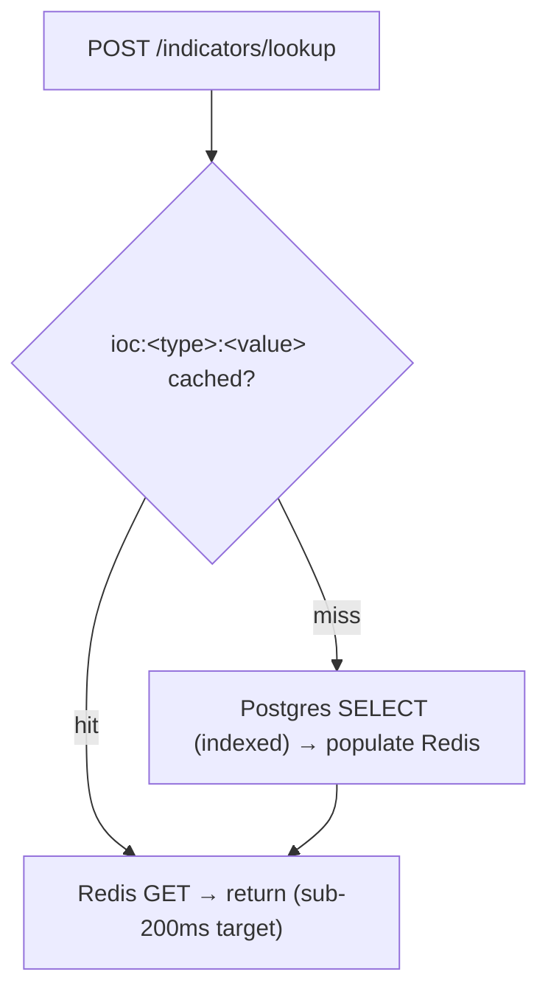
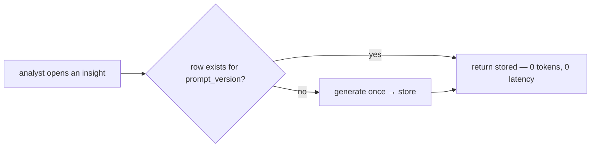

# Caching Impact

Caching is the platform's single largest performance lever, because the
dominant cost is *external calls* and caching is how those are avoided. There
are two caches with very different impacts (`10_implementation/
caching_implementation.md`).

## Impact 1 — Redis on the IOC hot path

The IOC lookup is the latency-critical operation. Without a cache, every
lookup is a Postgres query; with the cache, a repeat lookup within 10 minutes
is a single Redis GET.

| Scenario | Path | Relative cost |
|---|---|---|
| Cache hit | Redis GET | lowest (the design target) |
| Cache miss | indexed Postgres SELECT + cache populate | higher, then warm |

The impact is concentrated exactly where it matters: during alert triage an
analyst often checks the **same** indicators repeatedly (the IP/domain/hash
from one alert appears across several Wazuh events), so the hit rate on the
hot path is expected to be high **[inferred]**. The sub-200ms figure is a
**[target]**, not a measured latency.

## Impact 2 — circuit-breaker state in Redis

`fetch_with_resilience` checks `is_open(source)` before every external call.
Backing that check with Redis (`health:<svc>:<source>`, 60s TTL) instead of
Postgres makes the breaker check a fast in-memory read on the ingestion hot
path, so a *degraded* source is skipped almost for free rather than incurring
a DB read per skip (`10_implementation/fault_tolerance.md`).

## Impact 3 — cache-first AI insights (cost, not just latency)

For AI, the cache impact is measured in **provider quota and money** as much
as latency. Insights are stored durably in `*_insights` tables keyed by
`prompt_version`; a viewed insight is served from Postgres with **zero AI
calls**.

This is what makes the platform usable under tight GitHub Models quotas
(`gpt-5-chat` 12/day): without cache-first storage, re-opening a report would
re-bill an LLM call and quickly exhaust the daily allowance. The flowviz
attack-flow cache (`sha256(input + PROMPT_VERSION)`) has the same effect —
"save all attack flows so we don't re-run them and waste AI" was a direct
user requirement satisfied by this cache.

## Impact 4 — the AI response cache

Beyond per-resource insight rows, identical AI prompts are cached at
`ai:<sha256(prompt)>` for 24h. This catches the case where the same prompt is
issued more than once within a day and returns the prior completion without a
provider call — a second line of quota defence behind the insight tables.

## The cost side of caching (honest)

Caching is not free, and the design accounts for it:

| Cost | How it is bounded |
|---|---|
| Staleness | TTLs are short where freshness matters (IOC 10m, breaker 60s); insights are invalidated by `prompt_version` |
| Empty-overwrite risk | the insight cache **rejects empty payloads** (the "hunting hypothesis disappeared" fix) |
| Memory | only loss-tolerant data in Redis; business state stays in Postgres (`G6`) |

## Net effect on performance

| Concern | Without caching | With caching (current) |
|---|---|---|
| Repeat IOC lookup | Postgres query each time | Redis GET (target sub-200ms) |
| Breaker check | DB read per skip | Redis read |
| Re-viewing an insight | a fresh LLM call (latency + quota) | free Postgres read |
| Re-requesting a flow | a fresh LLM call | stored `{nodes, edges}` |

The honest summary: caching turns the platform's two most expensive
operations — external IOC lookups and AI generation — into cheap reads on
the common (repeat) path, while the durable insight/flow tables protect the
scarcest resource of all, the provider quota.
