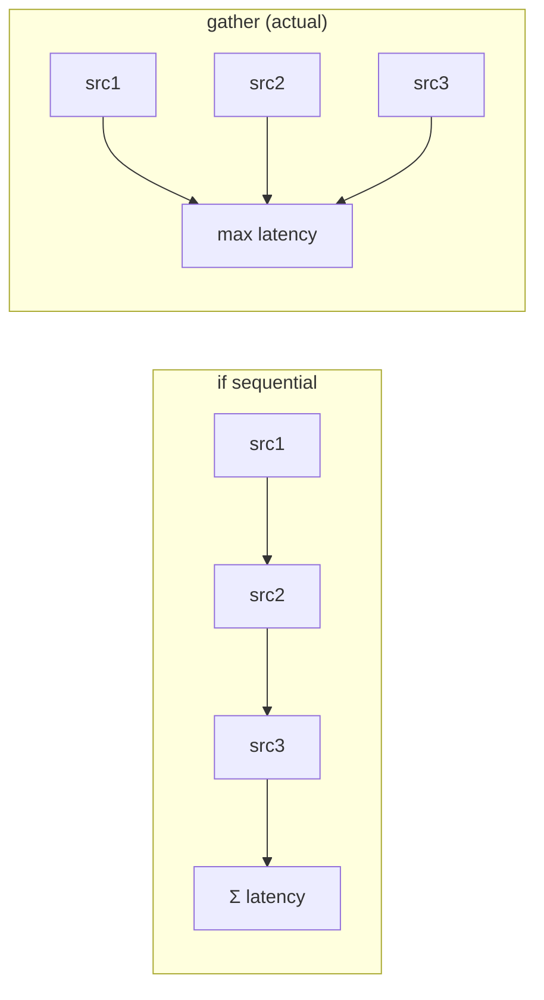

# Optimization

This document lists the optimisations that are **actually implemented** in
the codebase — not aspirational tuning. Each is tied to the problem it
solves. None is a micro-optimisation; all target the I/O-bound reality that
external calls dominate cost (`overview.md`).

## 1. Redis hot path for IOC lookup

The single most deliberate optimisation. `POST /indicators/lookup` checks
Redis (`ioc:<type>:<value>`) before Postgres, populating on miss. It exists
to hit the sub-200ms triage target (`caching_impact.md`). **Impact:** repeat
lookups become an in-memory read.

## 2. Cache-first AI insights + flow cache

Insights and attack flows are stored durably and served without
re-generating. **Impact:** re-viewing costs zero AI latency and zero provider
quota — the optimisation that makes AI usable under daily quotas
(`caching_impact.md`).

## 3. Incremental NVD pull

`vuln-intel` pulls only the `lastModified` window since the newest CVE it
already has, rather than re-fetching the catalogue every cycle
(`06_services/vuln_intel_service`). **Impact:** steady-state CVE refresh
touches only new/changed records, turning a potential full-catalogue pull
into a small delta each 6h. (The one-time full backfill is the ~90-minute
cost in `bottlenecks.md`.)

## 4. Layer-cached per-service images

Dockerfiles copy `packages/` and install dependencies **before** copying
service code, so a code change does not invalidate the slow dependency layer
(`12_technology_choices/containerization_stack.md`). **Impact:** incremental
rebuilds and deploys touch one image and skip dependency reinstallation.

## 5. Connection pooling via PgBouncer

Transaction pooling multiplexes 15 services' pools onto few Postgres
backends. **Impact:** the platform stays within Postgres's connection ceiling
that 15 independent pools would otherwise blow past
(`12_technology_choices/database_stack.md`).

## 6. Async fan-out for independent I/O

Ingestion, investigation, and dashboard aggregation issue their independent
external calls concurrently with `asyncio.gather`, so total latency is ~the
slowest call, not the sum (`10_implementation/async_implementation.md`).
**Impact:** the orchestrator's 6-way context fan-out and indicator-intel's
multi-source investigation complete in roughly one call's time, not six.

## 7. Serialized AI legs (an anti-optimisation, on purpose)

The one place parallelism was **removed**: AI legs are serialized because
GitHub Models caps concurrency at 1–2. Running them in a `gather` tripped a
rate limit. **Impact:** AI requests succeed reliably instead of failing on
concurrency — slower wall-clock per multi-leg insight, but correct
(`10_implementation/ai_implementation.md`). This is the honest case where the
right "optimisation" was to do less in parallel.

## 8. Smart-model fallback cascade

Rather than fail when a model's daily quota is exhausted, requests cascade to
the next model (client-side **and** proxy-side). **Impact:** AI features keep
working through quota exhaustion instead of going dark
(`12_technology_choices/ai_stack.md`).

## 9. Bounded AI payloads

Related context is capped before prompting (actors 10, IOCs 25, articles 10,
notes 20). **Impact:** bounds prompt size → bounds both latency and token
cost per call (`13_performance/performance_characteristics.md`).

## 10. Indexed, paginated reads

List endpoints query indexed columns and paginate (`07_database/
indexing_strategy.md`); the fields the platform filters on (CVE id, indicator
value, severity, status) are promoted out of JSONB into real indexed columns.
**Impact:** list reads stay fast as tables grow.

## What was deliberately NOT optimised

Honesty requires naming the non-optimisations:

| Not done | Why acceptable |
|---|---|
| No query-plan tuning / `EXPLAIN ANALYZE` pass | data volumes modest; indexes cover the access patterns |
| No CDN / static-asset optimisation | internal intranet app |
| No connection-level read replicas | single-host scope |
| No formal load-test-driven tuning | no benchmark harness (`benchmarks.md`) |

The optimisation effort went where the cost is — avoiding external calls —
not into speculative tuning of code that the latency budget shows is not the
bottleneck.
