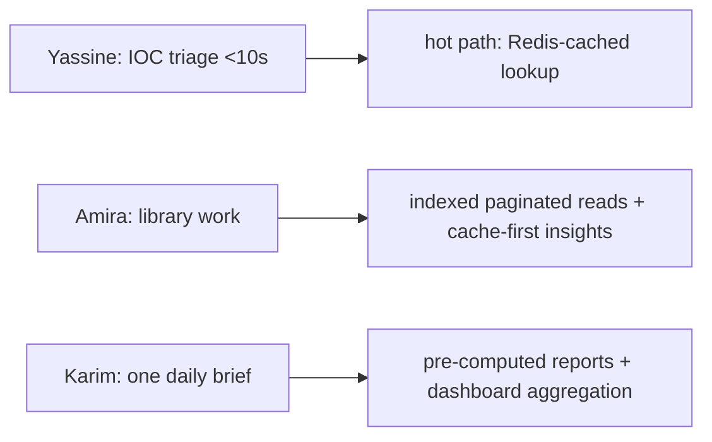

# Performance — Overview

## A note on measured vs. inferred (read first)

This chapter is scrupulous about a distinction the rest of the documentation
also observes:

- **Measured** — an observed runtime fact (e.g. KEV backfill took ~90 minutes
  without an NVD key; an `/ask` query returned a 1355-character answer).
- **Configured** — a value set in code (e.g. pool sizes, cache TTLs, retry
  policy).
- **Target** — a design goal the system was built toward (e.g. sub-200ms IOC
  lookup) that was **not** captured with a formal benchmark harness.
- **Inferred** — a reasoned expectation from the architecture, not a
  measurement.

**There is no formal benchmark suite in this project.** No load test, no
latency histogram, no throughput measurement was captured. Reporting precise
latency or throughput numbers would therefore be fabrication. This chapter
states design targets and the optimisations that pursue them, labels every
quantitative claim by the categories above, and is explicit where a number is
*not* available (`benchmarks.md`).

## The performance philosophy

The platform is optimised for the access pattern its users actually have, not
for a generic throughput maximum:

| User | Dominant operation | Performance strategy |
|---|---|---|
| Yassine (SOC) | IOC lookup, alert triage | Redis hot path, sub-200ms target |
| Amira (TI) | browsing + AI insights | indexed reads; insights cached durably |
| Karim (manager) | reading the daily brief | brief pre-computed by the scheduled cycle |

The guiding rule (`G2`): **read APIs serve stored data and never block on a
live fetch** ("stale over blocking"). Performance, correctness, and fault
tolerance are the same decision — the user always gets a fast answer from
Postgres/Redis, never a hang waiting on NVD or an LLM.

## What dominates latency

The honest performance model is that **platform code is rarely the
bottleneck** — external dependencies are:

| Request class | Dominated by | Platform's contribution |
|---|---|---|
| IOC lookup (hit) | Redis round-trip | negligible |
| List read | Postgres indexed query | small |
| AI insight / cycle | **provider latency** (seconds) | small (fan-out + validate) |
| Ingestion cycle | **external feed latency** | small (parse + upsert) |

This is the expected profile for an I/O-bound system (`12_technology_choices/
async_stack.md`) and it shapes every optimisation: the wins come from
*avoiding* external calls (caching), not from shaving CPU.

## Chapter contents

| Document | Focus |
|---|---|
| `performance_characteristics.md` | per-layer behaviour, configured values, targets |
| `caching_impact.md` | how caching shapes latency and cost |
| `optimization.md` | the concrete optimisations actually implemented |
| `bottlenecks.md` | the honest known bottlenecks and their causes |
| `scalability.md` | vertical and horizontal scaling paths |
| `benchmarks.md` | what was observed; what was NOT measured |
