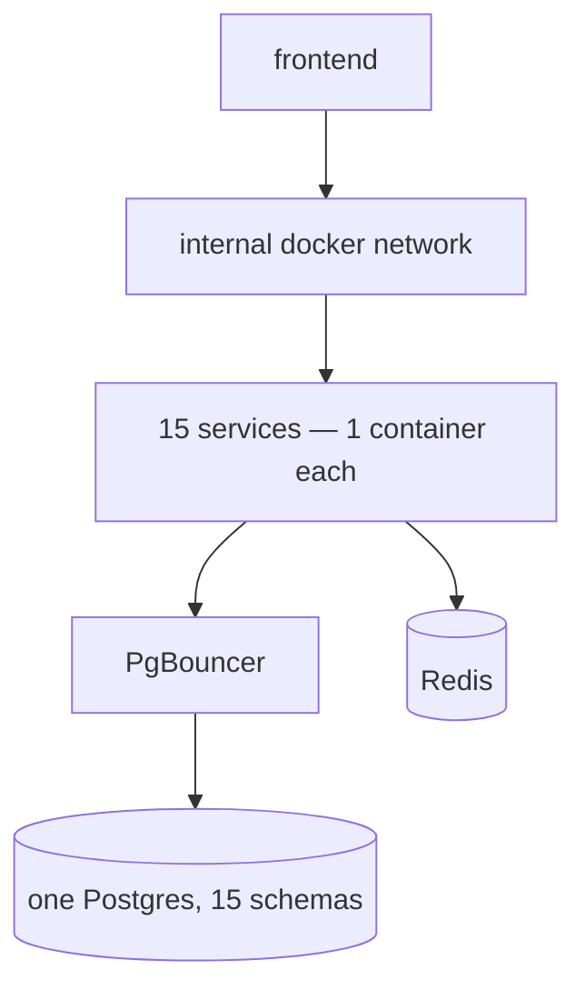
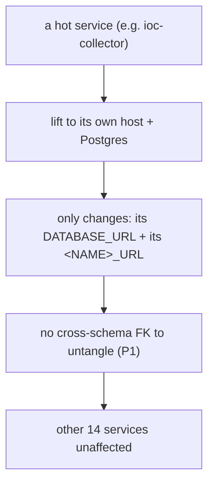

# Scalability

This document describes how the platform can grow beyond its current
single-host deployment, and — crucially — what in the architecture makes that
growth cheap. The current deployment does not need to scale; the design
ensures it *can*.

## Current state: one host, one container per service

This is sufficient for the workload (one finance-enterprise tenant; bursty
ingest + low-volume analyst reads) and is a deliberate scope choice
(`12_technology_choices/infrastructure_stack.md`).

## Vertical scaling (the first lever)

The simplest growth path is a bigger host. Because the stack is a single
Compose project, adding CPU/RAM to the host benefits every container with no
configuration change. The connection pools (10+15 per service) and PgBouncer
have headroom for more concurrent work on a larger host. This is the
**immediate** answer to "more load" and requires zero architectural change.

## Horizontal scaling — what the architecture enables

The architecture was built so horizontal scaling is a configuration change,
not a rewrite. Three properties make this true:

### 1. Stateless services

Every service except the databases is stateless — all state is in Postgres or
Redis (`10_implementation/runtime_behavior.md`). A stateless service can be
**replicated**: run N containers behind a round-robin and they share the same
DB/cache. The only services that are *not* trivially replicable are the
scheduler (must be a singleton to avoid double-firing jobs) and one-shots.

### 2. Schema-per-service with no cross-schema FKs (the key enabler)

This is the most important scalability property. Because **no foreign key
crosses a schema boundary** (`P1`) and **all cross-service data flow is HTTP**
(not SQL joins), any single service can be moved to its own host and its own
database with only:

- a change to that service's `DATABASE_URL`, and
- a change to the `<NAME>_URL` other services use to reach it.

No data migration spanning services, no join to rewrite, no shared
transaction to split. The schema boundary that provides isolation today is
the seam along which the platform splits tomorrow
(`12_technology_choices/database_stack.md`).

### 3. URL-based service discovery

Every service reads its peers' URLs from `<NAME>_URL` env vars, hardcoding
nothing (`10_implementation/backend_implementation.md`). Moving a service to a
new host is an env-var change, which is exactly what makes property 2 cheap.

## The orchestration upgrade path

For genuine multi-host HA, the migration target is **Kubernetes**
(`12_technology_choices/infrastructure_stack.md`). The stateless services map
to Deployments with replicas; the scheduler maps to a single-replica
Deployment or a CronJob set; Postgres and Redis map to managed services or
StatefulSets. The Compose file is effectively a one-node manifest of this
topology, so the translation is mechanical.

## Scaling the data tier

| Pressure | Response |
|---|---|
| Connection count | PgBouncer already multiplexes; raise pool sizes or PgBouncer limits |
| Read load on one schema | promote that service to its own Postgres (property 2) |
| Write load | per-service Postgres instances remove contention between services |
| Cache load | Redis can be clustered; cache is loss-tolerant so failover is safe |

## Scaling AI throughput

AI scaling is **provider-bound**, not platform-bound (`bottlenecks.md`). The
levers are: add provider keys/quota on the LiteLLM proxy, broaden the
fallback cascade, and lean harder on cache-first insights. The platform side
already parallelises everything it safely can (and serializes what it must).

## Honest limits

| Limit | Status |
|---|---|
| Scheduler is a singleton | must stay single to avoid duplicate job firing; not horizontally scaled |
| Single Postgres today | one failure domain; the split path is enabled but not exercised |
| No autoscaling | manual capacity decisions; appropriate for the scope |
| Multi-host untested | the path is designed (P1 + URL discovery) but has not been deployed |

The truthful summary: the platform is **scale-ready by design but
single-host by deployment.** The schema-per-service boundary and URL-based
discovery are the concrete enablers that make scaling a configuration
exercise rather than a re-architecture — but that exercise is future work
(`16_future_work`), not something this deployment has performed.
