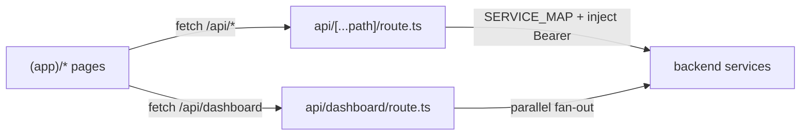
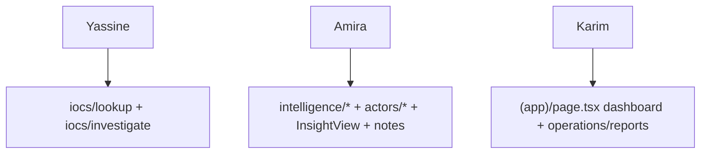

# Frontend Structure

The frontend is a Next.js 16 App Router application. The tree below is from
the actual `frontend/src/`, not the plan — where the two differ, this
documents reality.

## Layout

```
frontend/src/
├── app/
│   ├── layout.tsx                 root layout (theme provider)
│   ├── login/page.tsx             unauthenticated login
│   ├── (app)/                     route group — all authenticated pages
│   │   ├── layout.tsx             AppShell (sidebar + topbar)
│   │   ├── page.tsx               dashboard
│   │   ├── intelligence/          articles, cves, threats, supply-chain, ransomware (+ [id])
│   │   ├── iocs/                  list, [id], lookup, investigate
│   │   ├── actors/               list, [id], ransomware
│   │   ├── integrations/         wazuh, misp
│   │   ├── assets/               list, profile
│   │   ├── surface/              scopes, domains
│   │   ├── operations/           scheduler, policies, reports
│   │   ├── flowviz/              attack-flow generator
│   │   ├── ask/                  AI Q&A
│   │   ├── admin/                users, roles, sessions, feeds
│   │   └── settings/
│   └── api/
│       ├── [...path]/route.ts     the BFF catch-all proxy
│       └── dashboard/route.ts     the fan-out aggregation route
├── components/
│   ├── layout/                    Shell, Sidebar, Topbar, CommandPalette
│   └── shared/                    KPI, Sparkline, Bar, Ring, StatusDot, Flag,
│                                  FilterBar, Pagination, SortHeader, TagPicker,
│                                  AttackFlowGraph, InsightView
├── lib/                           api, hooks, store, askStore, sort, serverSort, theme
└── types/                         common.ts
```

## The `(app)` route group — auth boundary

The parenthesised `(app)` segment is a **Next.js route group**: it applies a
shared layout (the authenticated `AppShell`) to everything inside without
adding a URL segment. `login/` sits outside it. This cleanly separates the
one public page from every page that requires a session
(`12_technology_choices/frontend_stack.md`).

## The two API routes are the BFF



- `api/[...path]/route.ts` — the catch-all proxy: maps the first path segment
  to a service, injects the JWT from the httpOnly cookie, forwards
  (`10_implementation/frontend_implementation.md`).
- `api/dashboard/route.ts` — the one aggregation route, fanning out to several
  services in parallel for the dashboard.

These two files are the entire server-side surface of the frontend — the
security boundary in two route handlers.

## `lib/` — the client foundation

| File | Role |
|---|---|
| `api.ts` | typed fetch wrapper; `PRE_AUTH_PATHS` bypass; conditional Bearer |
| `hooks.ts` | SWR hooks per resource (`useArticles`, `useCVEs`, `useNotes`, `useInsight`, …) |
| `store.ts` | Zustand store (auth, preferences, sidebar) |
| `askStore.ts` | Ask-AI conversation state |
| `sort.ts` / `serverSort.ts` | client-side and server-aware sorting helpers |
| `theme.ts` | Ant Design dark-theme token overrides |

Note the structure differs from the original plan: hooks are consolidated in
a single `hooks.ts` (not a `hooks/` directory of many files), which is the
real, simpler organisation.

## `components/` — layout vs shared

- `layout/` — the chrome: `Shell` (sidebar + topbar + content), `Sidebar`,
  `Topbar`, `CommandPalette` (the ⌘K search).
- `shared/` — the reusable widgets: status/severity/confidence visuals
  (`StatusDot`, `Bar`, `Ring`, `Sparkline`, `Flag`), table furniture
  (`FilterBar`, `Pagination`, `SortHeader`, `TagPicker`), and the two
  feature components `AttackFlowGraph` (ReactFlow) and `InsightView` (AI
  insight rendering reused across resource pages).

## How the structure serves the three personas



The directory map is a map of the workflows: fast lookup paths for the SOC
analyst, the intelligence library for the TI analyst, the dashboard and
reports for the manager (`01_introduction/stakeholders.md`).
