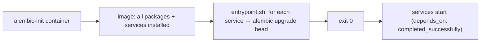

# Infrastructure Structure

The `infra/` directory is the entire deployment definition — the platform is
reproducible from this directory plus a Docker host (`09_devops/
infrastructure_management.md`).

## Layout

```
infra/
├── docker-compose.yml          production-shape stack (all containers, healthchecks, depends_on)
├── docker-compose.dev.yml      dev overlay (bind-mount packages/, DISABLE_AUTH=true, debug logs)
├── alembic-init/               one-shot migration container
│   ├── Dockerfile              installs every package + service so env.py can import models
│   └── entrypoint.sh           iterates services, runs each one's migrations
├── bootstrap/                  seed + diagnostic scripts (Python)
│   ├── seed_secrets.py         RS256 keypair, per-service tokens, LITELLM_MASTER_KEY, credentials.env
│   ├── set_secrets.py          individual secret writes
│   ├── smoke_test.py           probe /health on all 15 + litellm
│   ├── check_litellm.py        exercise the AI chain
│   ├── seed_cmdb_mock.py       realistic company profile + assets
│   └── seed_knowledge_base.py  baseline intelligence data
├── pgbouncer/
│   └── pgbouncer.ini           transaction-pooling config
└── litellm/                    proxy routing + fallback config
```

## The two compose files

| File | Role |
|---|---|
| `docker-compose.yml` | the production-shape stack — built images, healthchecks, `depends_on` conditions, restart policies |
| `docker-compose.dev.yml` | the overlay — only the *differences* for development |

Compose merges them left-to-right; `make up` applies both with
`--env-file .env` (`09_devops/orchestration.md`). The base file is the single
inventory of the whole system — the compliance officer's egress audit list
(`01_introduction/stakeholders.md`).

## `alembic-init/` — migration as a one-shot



The image is intentionally "fat" — it installs every package and service so
each service's `alembic/env.py` can import its `app.models` METADATA
(`09_devops/ci_cd.md`). Running migrations in one ordered, one-shot container
ensures the schema is migrated exactly once before any service starts, with no
service racing another to create a table.

## `bootstrap/` — the scripts that stand in for tooling

This directory holds the scripts that, in a larger setup, a pipeline would
run. They split into **seeders** and **diagnostics**:

| Kind | Scripts | Role |
|---|---|---|
| Seeders | `seed_secrets.py`, `set_secrets.py`, `seed_cmdb_mock.py`, `seed_knowledge_base.py` | populate the vault and realistic data |
| Diagnostics | `smoke_test.py`, `check_litellm.py` | the verification layer (`11_testing`) |

`seed_secrets.py` is the keystone of the bootstrap dance — it writes the RS256
keypair, the per-service bootstrap tokens, and `LITELLM_MASTER_KEY` into the
vault before auth and the AI services start (`10_implementation/
runtime_behavior.md`).

## `pgbouncer/` and `litellm/` — the two centralised mediators

These two directories configure the platform's two "decided once" mediators:

- `pgbouncer/pgbouncer.ini` — transaction pooling that multiplexes 15
  services onto few Postgres backends (`12_technology_choices/
  database_stack.md`).
- `litellm/` — the AI gateway routing + fallback config that holds provider
  keys and implements the server-side fallback cascade
  (`12_technology_choices/ai_stack.md`).

That both are *configuration directories*, not code, reflects the design
principle: the hard shared concerns are centralised mediators configured in
`infra/`, not logic scattered across services.

## What is NOT in `infra/`

| Not here | Where instead / why |
|---|---|
| Secret *values* | the encrypted vault (`secrets` schema); only `seed_secrets.py` (the script) is here |
| `.env` | host-managed, never committed |
| Terraform/Ansible | none — host is provisioned manually (`09_devops/infrastructure_management.md`) |
| Backups | operator-managed `pg_dump`, outside compose |
