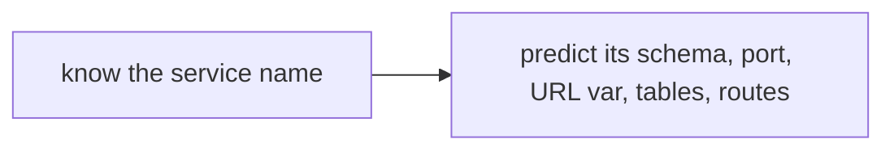

# Naming Conventions

Consistent naming is what makes a 15-service, 9-package monorepo navigable.
The conventions below are followed throughout and are mechanical enough to
predict a name you have not seen.

## Services

| Aspect | Convention | Example |
|---|---|---|
| Directory | kebab-case | `services/news-collector/` |
| Container / hostname | same kebab-case | `news-collector` |
| Schema | short snake | `news` |
| Port | 8000–8014, in catalog order | `news-collector` = 8001 |

The port and schema for any service are fixed and listed in the catalog
(`06_services/README.md`). auth is 8000; ports increment in the documented
order through orchestrator at 8014.

## Schemas

One Postgres schema per service, named for the **domain**, not the service
directory:

| Service | Schema |
|---|---|
| news-collector | `news` |
| vuln-intel | `vuln` |
| ioc-collector | `ioc` |
| threat-actors | `actors` |
| indicator-intel | `indicator` |

The schema is the shorter domain noun; the service directory is the fuller
hyphenated name. This is deliberate — the schema names read cleanly in SQL
(`ioc.indicators`, `vuln.cves`) while the service names read as deployables.

## Environment variables

| Purpose | Convention | Example |
|---|---|---|
| Downstream service URL | `<NAME>_URL` (upper snake) | `NEWS_COLLECTOR_URL`, `ORCHESTRATOR_URL` |
| Per-service bootstrap token | `SVC_<NAME>_BOOTSTRAP_TOKEN` | `SVC_VULN_INTEL_BOOTSTRAP_TOKEN` |
| Shared root secrets | descriptive upper snake | `FERNET_KEY`, `SECRETS_BOOTSTRAP_TOKEN` |
| Feature flags | upper snake | `DISABLE_AUTH`, `TIP_ENV` |

The `<NAME>_URL` convention is load-bearing: it is what makes service
discovery a configuration change and horizontal scaling cheap
(`13_performance/scalability.md`). No URL is ever hardcoded.

## Shared packages

| Aspect | Convention | Example |
|---|---|---|
| Package name | `tip_<concern>` (snake) | `tip_http`, `tip_source_health` |
| Distribution name | `tip-<concern>` (hyphen) | `tip-http` (in `pyproject.toml`) |
| Import path | `tip_<concern>` | `from tip_http import fetch_with_resilience` |

The `tip_` prefix namespaces all shared code and makes an import instantly
recognisable as platform-internal versus third-party.

## Database objects

| Object | Convention | Example |
|---|---|---|
| Table | plural snake | `articles`, `cve_relevance`, `notification_rules` |
| Per-service health table | `source_health` | every ingester has one |
| Insight table | `<resource>_insights` | `article_insights`, `cve_insights` |
| Notes table | `<resource>_notes` | `article_notes`, `actor_notes` |
| JSONB flex column | `raw` / `payload` / `details` / `confidence_inputs` | consistent across services |

The `<resource>_insights` and `<resource>_notes` patterns are what let the
shared factories (`build_notes_router`, `generate_insight`) work uniformly
across services (`14_.../shared_packages.md`).

## API routes

| Pattern | Example |
|---|---|
| Resource list / item | `GET /articles`, `GET /articles/{id}` |
| AI insight | `GET /<resource>/{id}/insight`, `POST /<resource>/{id}/analyze` |
| Notes | `/<resource>/{id}/notes` |
| Status triage | `PATCH /<resource>/{id}/status` |
| Health | `GET /health`, `GET /health/sources` |
| Scheduler trigger | `POST /ingest/run`, `/refresh/*`, `/scan/run`, `/check/run`, `/analyze` |

These are consistent enough that the frontend's BFF `SERVICE_MAP` can route by
first path segment alone (`10_implementation/api_implementation.md`).

## Migrations

`NNNN_description.py` with a zero-padded sequence per service
(`0001_initial.py`, `0002_profile_change_log.py`), each in that service's own
`alembic/versions/` with its own version table (`07_database/migrations.md`).

## The payoff

Because the conventions are mechanical, knowing one fact about a service lets
you predict the rest: from `threat-actors` you can derive schema `actors`,
port 8005, `THREAT_ACTORS_URL`, tables like `actors`/`actor_insights`/
`actor_notes`, and routes like `GET /actors/{id}/insight`. That predictability
is the goal of every convention here.
