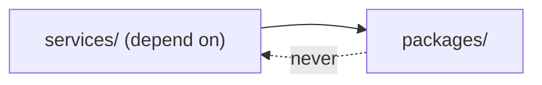

# Project Structure — Overview

The repository is a **uv-based Python monorepo** plus a Next.js frontend and
an `infra/` deployment layer. The structure expresses the architecture
directly: shared logic in `packages/`, deployable services in `services/`,
and a strict dependency direction between them.

## Top-level layout

```
PFE-TIP/
├── services/        15 deployable FastAPI services (one folder each)
├── packages/        9 shared libraries (uv path dependencies)
├── frontend/        Next.js 16 application (UI + BFF)
├── infra/           docker-compose, alembic-init, bootstrap, pgbouncer, litellm
├── prompt/          the spec (source of truth) + credentials.env
├── AvailableServices/  legacy code refactored into flowviz / asm / domainwatch
├── OpenAPI/         per-service openapi.json snapshots
├── screenshots/     Playwright walkthrough + captured PNGs
├── docs/            this documentation suite
├── CLAUDE.md        the living build/architecture notes
├── Makefile         operator commands
├── pyproject.toml   root tooling config (ruff, mypy)
└── .env.example     the two root secrets + bootstrap params
```

## The one rule that governs structure



**Services depend on packages; packages never depend on services.** This
unidirectional rule is what keeps the shared layer reusable and the services
independent. A package may depend on another package (e.g. `tip_http` →
`tip_common`), but no package imports anything from `services/`
(`diagrams/module_dependencies.mmd`).

## Why a monorepo

| Benefit | How the layout delivers it |
|---|---|
| Single source of truth for shared logic | `packages/tip_*`, path-installed everywhere |
| Independent service builds | each service has its own `pyproject.toml` + Dockerfile |
| Atomic cross-cutting changes | a `tip_common` change + all callers in one commit |
| Consistent tooling | one root `pyproject.toml` for ruff + mypy |

The monorepo with **path dependencies** (not a published-package registry)
gives shared code without a release cycle, while per-service Dockerfiles keep
builds independent and layer-cacheable (`12_technology_choices/
containerization_stack.md`).

## Chapter contents

| Document | Covers |
|---|---|
| `repository_layout.md` | each top-level directory in detail |
| `shared_packages.md` | the 9 `tip_*` libraries and their real modules |
| `service_anatomy.md` | the standard internal layout of a service |
| `frontend_structure.md` | the Next.js app tree |
| `infra_structure.md` | the `infra/` deployment layer |
| `naming_conventions.md` | schemas, ports, env vars, URLs, packages |

Every file list in this chapter is drawn from the actual tree, not an
idealised template.
