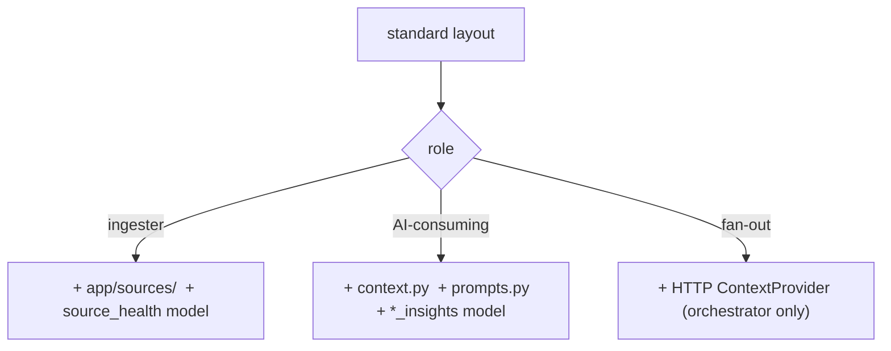

# Service Anatomy

Every service has the same internal shape. Learning it once means all 15 are
navigable. This document shows the standard layout with two real examples — a
simple service (cmdb) and a full service (orchestrator).

## The standard layout

```
services/<name>/
├── pyproject.toml          deps (incl. tip_* path deps) + service metadata
├── Dockerfile              per-service image (layer-cached)
├── alembic/
│   ├── env.py              imports app.models METADATA; sets version_table_schema
│   └── versions/           per-service migrations (0001_…, 0002_…)
└── app/
    ├── main.py             create_service_app + _startup hook + include_router
    ├── settings.py         Settings(BaseServiceSettings) — service-specific fields
    ├── models.py           SQLAlchemy models (this service's schema only)
    ├── schemas.py          Pydantic request/response models
    ├── db.py               session dependency wiring
    └── routes/             one module per resource group
```

This mirrors the shared skeleton (`06_services/README.md`): `main.py` wires
the factory, `_startup` attaches engine/cache/secrets/AI to `app.state`,
routers are thin and async.

## Example 1 — cmdb (a simple service)

```
services/cmdb/app/
├── main.py
├── settings.py
├── models.py          assets, org_profile_versions, tag_catalog, profile_change_log
├── schemas.py         Identity, CompanyProfile, AssetIn/Out, …
├── db.py
├── asm_sync.py        the CMDB→ASM background-sync helper (Phase 3)
└── routes/
    ├── assets.py
    ├── profile.py
    └── tags.py
services/cmdb/alembic/versions/
├── 0001_initial.py
├── 0002_profile_change_log.py
└── 0003_tag_catalog.py
```

cmdb is the "thin vertical slice" archetype: a few models, a few route
modules, no AI, no external sources. Most services look like this.

## Example 2 — orchestrator (a full service)

```
services/orchestrator/app/
├── main.py
├── settings.py
├── models.py          reports, cve_relevance, actor_likelihood, correlations,
│                      ai_policies, action_runs, source_health,
│                      notification_rules, notification_dispatches
├── schemas.py
├── db.py
├── context.py         OrchestratorContextProvider — HTTP fan-out over 6 services
├── analysis.py        the 4-step cycle dispatcher
├── policies.py        AI-policy resolver
├── prompts.py         versioned prompt templates
├── actions/           cve_relevance, actor_likelihood, correlation, brief,
│                      flowviz_action, extract_iocs, map_ttps,
│                      hunting_hypothesis, check_kev_exploited
├── notify/            dispatcher.py, smtp.py
└── routes/
    ├── analyze.py  policies.py  actions.py  notifications.py  health.py
```

orchestrator is the "synthesis" archetype: it adds a `ContextProvider`
implementation, an `actions/` registry, a policy engine, and a notification
subsystem on top of the same skeleton. The extra files are *additions* to the
standard shape, not deviations from it (`06_services/orchestrator_service`).

## What every service shares vs. what varies

| Always present | Varies by service |
|---|---|
| `app/main.py` (factory + startup) | number of `routes/` modules |
| `app/settings.py` | presence of `app/sources/` (ingesters only) |
| `app/models.py` (own schema) | presence of AI (`context.py`, `prompts.py`) |
| `app/schemas.py` | presence of `source_health` (ingesters) |
| `alembic/` with per-service versions | special base image (domainwatch) |
| `Dockerfile`, `pyproject.toml` | background helpers (`asm_sync.py`, `notify/`) |

## The role-based extras

A service's role (`10_implementation/backend_implementation.md`) shows up as
predictable extra files:



This predictability is the point: open any service, and its directory listing
tells you its role and where each concern lives before you read a line of
code.
