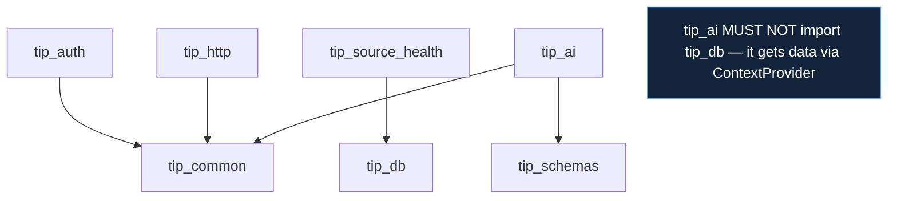

# Shared Packages

The nine `packages/tip_*` libraries hold every cross-cutting concern, decided
once and inherited by all 15 services. Each is a real package under
`src/<name>/`; the module lists below are from the actual tree.

## The nine packages

| Package | Modules | Responsibility |
|---|---|---|
| `tip_common` | `bootstrap.py`, `settings.py`, `logging_setup.py`, `correlation.py`, `errors.py`, `lifespan.py`, `auth_bootstrap.py`, `notes.py`, `scheduler_callback.py`, `sorting.py` | the service skeleton + shared utilities |
| `tip_auth` | `middleware.py` | RS256 JWT middleware + `require_permission` |
| `tip_db` | `base.py`, `session.py` | async engine (PgBouncer-tuned) + session factory |
| `tip_cache` | `__init__.py` | Redis async wrapper (JSON helpers, incr-with-TTL) |
| `tip_http` | `client.py`, `resilience.py` | httpx wrapper + `fetch_with_resilience` |
| `tip_secrets` | `client.py` | secrets-vault client (bootstrap-aware, cached) |
| `tip_source_health` | `models.py`, `repository.py` | `source_health` table + `SourceHealthRepository` |
| `tip_schemas` | `indicators.py`, `confidence.py`, `insights.py` | normalisation, confidence config, `AIInsight` |
| `tip_ai` | `litellm_client.py`, `openrouter.py`, `synthesis.py`, `protocol.py`, `factory.py` | AI client + structured-output synthesis + `ContextProvider` |

## `tip_common` — the keystone

The most-imported package; its `__init__.py` is the public surface every
service uses:

```python
from tip_common import (
    create_service_app, build_lifespan, BaseServiceSettings,
    CorrelationIdMiddleware, get_correlation_id,
    register_error_handlers, TIPError, NotFoundError, ConflictError,
    ValidationError, UpstreamError,
    configure_logging, get_logger,
    build_notes_router, NoteIn, NoteOut, NoteUpdate, NoteList,
    resolve_sort,
    extract_run_id, run_with_callback, notify_scheduler_complete,
    fetch_auth_public_key, obtain_service_jwt, wire_auth,
)
```

This is the architecture's comprehensibility in one import block: every
service builds from `create_service_app`, raises the same `TIPError`
hierarchy, logs the same way, and shares the same notes router and
scheduler-callback helpers (`10_implementation/implementation_overview.md`).

## The dependency rule among packages



Two structural invariants are enforced by these import edges:

- **`tip_ai` never imports `tip_db` or any service model.** It receives all
  data through the `ContextProvider` protocol (`protocol.py`). This is what
  lets the same `generate_insight` serve both a service's local-DB provider
  and the orchestrator's HTTP fan-out provider (`10_implementation/
  ai_implementation.md`).
- **`tip_common` depends on nothing else in `packages/`.** It is the root of
  the package DAG, so it can be imported anywhere without a cycle.

## Why these became packages (not copied code)

Each package is a concern that, if copied per service, would drift:

| If duplicated | Consequence avoided by sharing |
|---|---|
| resilience policy | 15 inconsistent retry/breaker implementations |
| engine tuning | a service forgetting `statement_cache_size=0` → PgBouncer errors |
| error envelope | inconsistent API error shapes |
| indicator normalisation | the cross-service join key diverging → broken correlation |
| JWT middleware | 15 places to fix an auth bug |

Centralising them means a fix or improvement lands once. The cost — a
`tip_common` change rebuilds many images — is the documented blast radius,
guarded by `mypy --strict` (`11_testing/coverage.md`).

## `packages/` as the architecture made tangible

The package list *is* the cross-cutting-concerns list from `04_solution_design`:
settings/logging/errors (`tip_common`), resilience (`tip_http`), caching
(`tip_cache`), source health (`tip_source_health`), confidence + normalisation
(`tip_schemas`), AI (`tip_ai`), auth (`tip_auth`), data (`tip_db`), secrets
(`tip_secrets`). Reading the package directory tells you exactly what the
platform solves once and shares.
