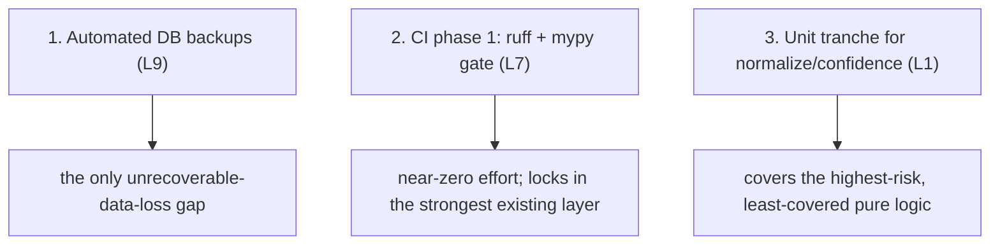

# Accepted Trade-offs

This is the master table. Every limitation from this chapter is listed once,
with the trade made, the rationale, and the pointer to its remedy. It is the
single page to read for "what did this project consciously give up, and why."

## The consolidated ledger

| ID | Limitation | Trade accepted | Rationale | Remedy (§16) |
|---|---|---|---|---|
| L1 | No unit/integration tests | verification breadth over depth | solo + timeline; mypy as net | unit + integration tranches |
| L2 | No benchmarks | targets, not measurements | internal-tool scope | k6/Locust baseline |
| L3 | Frontend type drift | hand-kept types | no codegen wired | OpenAPI codegen |
| L4 | Scheduler singleton | no scheduler HA | sufficient + simple | leader election |
| L5 | Dual engines (scheduler) | minor inconsistency | avoid beta APScheduler 4 | APScheduler 4 |
| L6 | JSONB unindexed risk | flexibility over forced indexing | store full upstream record | promote-and-index |
| L7 | No CI/CD | manual gates | solo + single host | phased pipeline |
| L8 | Single host / no HA | one failure domain | one tenant, one operator | Kubernetes |
| L9 | No automated backups | operator-managed recovery | not implemented in time | **`pg_dump` cron (priority)** |
| L10 | No metrics stack | app-level surfaces only | single-host sufficiency | Prometheus/Grafana/Loki |
| L11 | Manual deploy/rollback | rebuild, not re-pull | no registry | registry + CD |
| L12 | No secret rotation | manual rotation | scope | rotation job |
| L13 | Inter-service auth off | soft interior | network-isolated services | re-enable service JWTs |
| L14 | Default admin password | known fixture credential | dev/test convenience | force first-login change |
| L15 | Single `FERNET_KEY` | single-key blast radius | one thing to guard | envelope/KMS |
| L16 | No edge rate limiting | unbounded internal calls | small known user base | BFF rate limit |
| L17 | No dependency scanning | manual pinning only | no CI to run it | pip-audit + Trivy |
| L18 | AI quota dependence | AI can pause | free provider tiers | paid tiers / more keys |
| L19 | NVD unkeyed throughput | slow backfill | no key provisioned | provision NVD key |
| L20 | No real-time push | poll-interval latency | polling sufficed | SSE |
| L21 | Deferred watchlists | no saved subscriptions | needs notification surface | Phase 4 |
| L22 | One-way CMDB↔ASM | no discovery back-channel | v1 scope | back-channel |
| L23 | No IOC auto-promote | analyst-gated | deliberate safeguard | n/a (by design) |

## The three highest-priority remedies

If only three things were fixed, they should be — in order:

These three are chosen by **risk × ease**: backups close the one
catastrophic gap; the CI gate is almost free and enforces what already works;
the unit tranche covers the functions whose silent failure is most damaging
(`11_testing/coverage.md`).

## What the trade-offs are NOT

It is worth stating what was **not** traded away:

- **Architectural integrity** — schema-per-service, no cross-schema FKs, AI
  off the hot path, secrets centralised, resilience everywhere: all intact.
- **Functional completeness** — all 15 services and the full frontend are
  implemented and working on real data.
- **Honesty** — every gap is documented, not hidden.

The trade-offs are concentrated in the **operational and verification
maturity** layers, deferred deliberately and reversibly. That is the honest
shape of this project: a complete and principled system whose
production-hardening is its declared next phase, not a half-built one
pretending otherwise.
