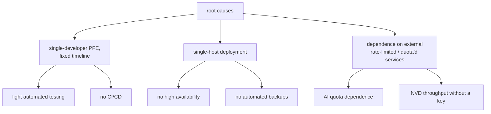

# Limitations — Overview

This chapter is the honest reckoning. Every documentation section above names
its own gaps; this chapter consolidates them so a reviewer, examiner, or
future maintainer has one place that states — without euphemism — what the
platform does not do, does not test, and does not yet handle.

## The guiding honesty principle

A limitation is recorded here if it is true, regardless of how it reflects on
the project. Each entry states the limitation, why it exists, the mitigation
(if any), and where the remedy lives in `16_future_work`. Nothing is
disguised as a feature.

## The shape of the limitations

Almost every limitation traces to one of three root causes: the **project
scope** (one developer, one timeline), the **deployment model** (one host),
or **dependence on external services** with their own limits. Recognising the
common roots is itself honest — these are not fifteen unrelated oversights but
the predictable consequences of three deliberate context choices.

## Severity at a glance

| Limitation | Severity | Mitigated? |
|---|---|---|
| No unit/integration test suite | high | partially (mypy + smoke + walkthrough) |
| No CI/CD pipeline | medium | scripts exist, run manually |
| Inter-service auth disabled | medium | network isolation (services not exposed) |
| Single host (no HA) | medium | restart policy; split path enabled |
| No automated DB backup | high | operator `pg_dump` recommended, not enforced |
| AI quota dependence | medium | cascade + cache-first + off hot path |
| No performance benchmarks | low–medium | observability data is capturable |
| Default admin password | low | flagged for rotation; dev default |
| Frontend type drift risk | low | walkthrough catches runtime shape errors |

## Chapter contents

| Document | Limitations covered |
|---|---|
| `technical_limitations.md` | testing, benchmarks, type drift, scheduler/engine warts |
| `operational_limitations.md` | single host, CI/CD, backups, monitoring stack, deploy/rollback |
| `security_limitations.md` | inter-service auth, default credentials, secret rotation |
| `functional_limitations.md` | AI quotas, NVD throughput, real-time, deferred features |
| `accepted_tradeoffs.md` | the consolidated table: limitation → rationale → remedy |

## The honest bottom line

The platform is a **complete, working, 15-service system with a full
frontend** that demonstrably ingests real data and produces real AI
intelligence. Its limitations are concentrated not in *what it does* but in
*how it is verified, operated at scale, and hardened* — the engineering
maturity layers (automated testing, CI/CD, HA, backups, benchmarking) that a
single-developer PFE on one host predictably defers. Those layers are the
substance of `16_future_work`, and the architecture was built to make adding
them cheap rather than to pretend they exist.
