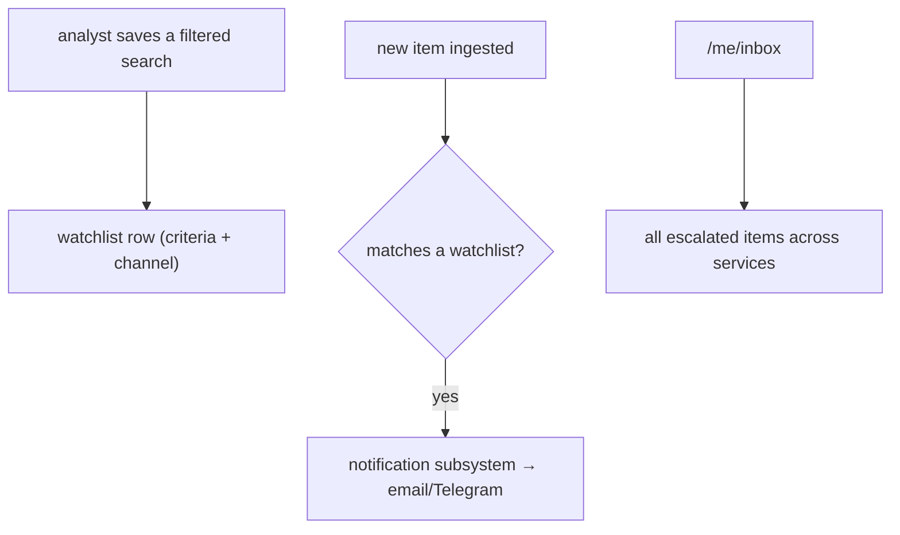
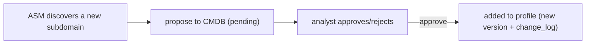
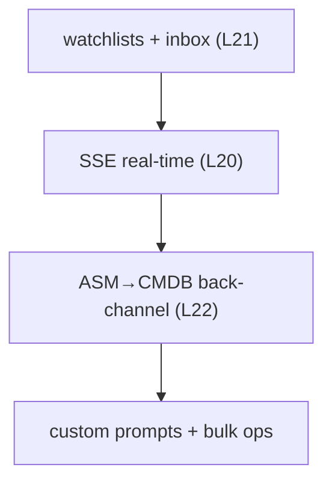

# Feature Roadmap

The remedy for the functional limitations (L20–L23) plus the explicitly
deferred Phase 4 capabilities. These are *additive* — none requires
re-architecture.

## 1. Watchlists / saved searches + inbox (closes L21)

The deferred Phase 4 capability. Analysts save a filter (e.g. "ransomware
threats targeting finance in MA") and get notified when new matching items
appear, plus a cross-service `/me/inbox` of all `escalated` items.

The building blocks exist: `analyst_status` triage and the notification
subsystem (`notification_rules` → `dispatches`). The work is the watchlist
store + the match-on-ingest hook.

## 2. Real-time push via SSE (closes L20)

Replace (or augment) SWR polling with Server-Sent Events for live surfaces:
the dashboard, new-alert notifications, and long-running job completion.

| Surface | Today (poll) | With SSE |
|---|---|---|
| Dashboard | 30s refetch | live KPI/brief updates |
| Background job done | poll `/runs` | push on completion |
| New escalated item | next list refetch | instant toast |

SSE (over WebSocket) is the simpler fit — the platform's real-time needs are
server→client push, not bidirectional. The BFF can hold the SSE connection
and fan out from a Redis pub/sub channel the services publish to.

## 3. ASM → CMDB back-channel (closes L22)

Today the sync is one-way (profile → ASM targets). The back-channel
auto-proposes newly discovered subdomains/IPs from ASM findings back into the
company profile for analyst approval.

The analyst-gate pattern (already used for IOC promotion and CMDB auto-add)
applies directly — discoveries are *proposals*, not silent writes.

## 4. Analyst-defined custom AI prompts per policy

The AI-policy engine already selects *which* actions run per category
(full_auto / category_auto / on_demand). The extension lets analysts override
the built-in action prompts per policy — tuning how the AI analyses a category
without code changes. Prompts are already versioned (`prompt_version`), so
custom prompts slot into the existing storage and cache-invalidation model.

## 5. Bulk operations

Once the per-row workflow is proven, add bulk endpoints:
`PATCH /articles/bulk/status`, bulk relevance flips, bulk analyze. The
idempotency + Redis dedup already built for the CMDB auto-add cascade
(Phase 3) is the mechanism that makes bulk flips safe.

## 6. Additional channels and integrations

| Extension | Built on |
|---|---|
| Telegram/webhook notification channels | the notification subsystem (SMTP is channel v1; schema already scaffolds others) |
| More ingest sources | per-service `app/sources/` modules — the documented extension point |
| More AI actions | the orchestrator `actions/` registry |
| STIX export of attack flows | the flowviz output (deferred in the refactor) |

## Sequencing rationale

Watchlists first (highest analyst value, building blocks exist), then SSE
(makes watchlists feel live), then the back-channel and power-user features.
All are additions to documented extension points, not changes to the core.
