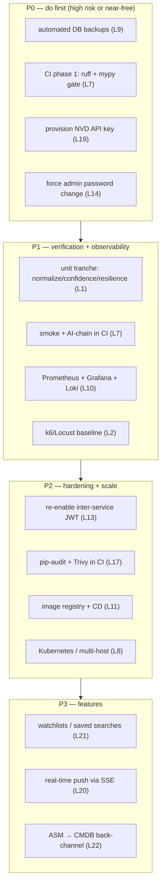

# Future Work — Overview

This chapter is the forward-looking counterpart to `15_limitations`: each
limitation there has a remedy here. The roadmap is **prioritised by risk ×
effort**, not by novelty — the first items are unglamorous hardening, because
that is what would most increase the platform's production-readiness.

## Prioritised roadmap

## The three P0 items (and why)

| Item | Limitation | Why first |
|---|---|---|
| Automated DB backups | L9 | the only **unrecoverable** gap — must close before anything else matters |
| CI phase 1 (ruff + mypy) | L7 | near-zero effort; the config exists; locks in the strongest existing layer |
| NVD key + force password change | L19, L14 | trivial, free, immediate risk reduction |

These four are achievable in days, not weeks, and together remove the
catastrophic-loss risk and the most obvious deployment footguns.

## How the chapter is organised

| Document | Roadmap area | Limitations addressed |
|---|---|---|
| `production_hardening.md` | backups, CI/CD, monitoring, deploy/rollback | L7, L9, L10, L11, L12 |
| `testing_roadmap.md` | unit, integration, E2E automation, benchmarks | L1, L2, L3 |
| `security_hardening.md` | service auth, KMS, rate limiting, scanning, credentials | L13–L17 |
| `feature_roadmap.md` | watchlists, real-time, back-channel, custom prompts | L20–L23 |
| `scaling_roadmap.md` | multi-host, Kubernetes, data-tier scaling | L4, L8 |

## The guiding principle for future work

The architecture was deliberately built so that **most of this roadmap is
additive, not corrective**. Re-enabling inter-service auth flips a flag
(the wiring is dormant, not deleted). Splitting a service to its own host is a
connection-string change (no cross-schema FKs to untangle). Adding CI is
orchestrating commands that already exit-code correctly. This is the payoff of
the principled design: the gaps in `15_limitations` are gaps in *what was
done*, not in *what the architecture allows* — so closing them is
straightforward, well-scoped engineering rather than rework.
