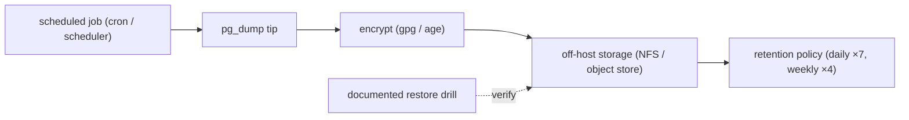
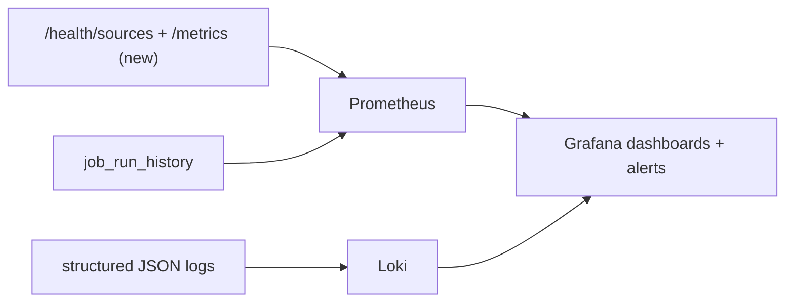
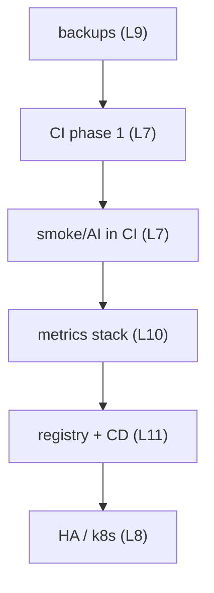

# Production Hardening

The operational-maturity layer deferred in `15_limitations` (L7–L12). This is
the highest-priority cluster because it concerns data safety and deployment
safety.

## 1. Automated database backups (closes L9) — **P0**

The single most important item. Postgres holds all business data **and** the
secrets vault; there is no automated backup today.

Minimum viable: a daily `pg_dump` to off-host storage with a tested restore
procedure. The restore drill matters as much as the dump — an untested backup
is a hope, not a recovery plan.

## 2. CI/CD pipeline (closes L7, L11) — phased

Adopt in the order of effort-to-value from `11_testing/ci_test_automation.md`:

| Phase | Add | Effort |
|---|---|---|
| 1 | pre-commit hook + CI job: `ruff` + `mypy --strict` | minimal (config exists) |
| 2 | CI: build images + run `alembic-init` on ephemeral Postgres | low |
| 3 | CI: `compose up` + `smoke_test.py` + `check_litellm.py` | low |
| 4 | CD: push images to a registry, deploy by tag | medium |

Phase 1 alone converts the project's strongest manual layer into an enforced
gate at near-zero cost. Phase 4 (a registry) also fixes rollback (L11):
rollback becomes `docker pull <last-good-tag>` instead of a rebuild.

## 3. Monitoring and observability stack (closes L10)

The data already exists (structured logs, `/health/sources`,
`job_run_history`, per-call `duration_ms`); only the collection/visualisation
layer is missing.

The first step is to add a `/metrics` endpoint per service (the
`duration_ms`, token-count, and source-health values are already computed —
they just need exposing). Then Prometheus scrapes, Loki ingests the existing
JSON logs, and Grafana provides the single-pane view and alerting the
platform currently lacks.

## 4. Deploy/rollback maturity (closes L11)

With a registry (CI phase 4) in place:

- deploys become `compose pull` of a tagged image, not a host rebuild;
- rollback becomes re-pulling the previous tag — instant, not a rebuild;
- the smoke test runs as an automated post-deploy gate.

## 5. Secret rotation (closes L12)

| Secret | Rotation approach |
|---|---|
| Provider API keys | already easy — update in vault, restart LiteLLM proxy; automate on a schedule |
| Service bootstrap tokens | already rotate on use in the auth/secrets dance |
| `FERNET_KEY` | the hard one — needs an envelope-encryption scheme (see `security_hardening.md`) so the master key can rotate without re-encrypting every row |

## 6. High availability (closes L8)

Covered in `scaling_roadmap.md` — the Kubernetes migration is what removes the
single-host failure domain. It is sequenced after the data-safety and
verification items because HA without backups and CI would be hardening the
wrong layer first.

## Sequencing rationale

Data safety first, then automated verification, then visibility, then delivery
automation, then HA. Each step makes the next safer to attempt.
