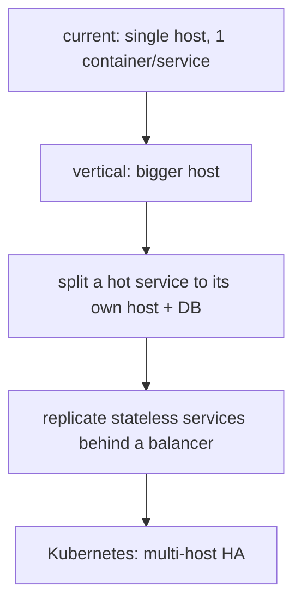
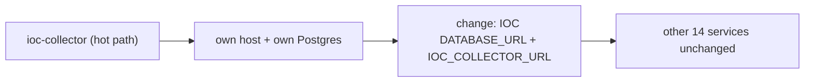

# Scaling Roadmap

The remedy for the scaling limitations (L4, L8). The central message: the
architecture already makes scaling a **configuration exercise**, so this
roadmap is about *exercising* enablers that already exist, not building new
ones.

## The scaling ladder

Each rung is enabled by an existing design property and is independently
useful — you can stop at any rung that meets demand.

## Rung 1 — vertical scaling (immediate, zero change)

Add CPU/RAM to the host. Every container benefits with no config change; the
pools (10+15 per service) and PgBouncer have headroom. This is the first and
often sufficient answer for an internal SOC tool
(`13_performance/scalability.md`).

## Rung 2 — split a hot service (the key enabler)

Because **no FK crosses a schema** (`P1`) and **all cross-service flow is
HTTP**, a hot service moves to its own host and database with only:

- its `DATABASE_URL`, and
- the `<NAME>_URL` its peers use to reach it.

No data migration spanning services, no join to rewrite. This is the property
the schema-per-service decision was *for* (`12_technology_choices/
database_stack.md`).

## Rung 3 — replicate stateless services

Every service except the scheduler is stateless (state lives in Postgres /
Redis), so it can run as N replicas behind a round-robin sharing the same
backing stores (`13_performance/scalability.md`). The two caveats:

| Service | Replication caveat |
|---|---|
| scheduler (L4) | must stay singleton — two would double-fire jobs; needs leader election before replicating |
| one-shots (alembic-init, seed) | not services; run once |

Adding leader election (or moving to a scheduler with native clustering) is
the prerequisite for the scheduler to join the replicated tier — the one
genuine scaling *development* item, versus the rest which are config.

## Rung 4 — Kubernetes for multi-host HA (closes L8)

The migration target for true high availability. The mapping is mechanical
because the Compose file is effectively a single-node manifest:

| Compose concept | Kubernetes equivalent |
|---|---|
| stateless service | Deployment + Service (with replicas) |
| scheduler | single-replica Deployment (post leader-election) |
| one-shot init | Job / initContainer |
| postgres, redis | managed service or StatefulSet |
| `depends_on` conditions | readiness/liveness probes + initContainers |
| `<NAME>_URL` env | Service DNS names |

HA is sequenced **after** the production-hardening cluster
(`production_hardening.md`) — backups, CI, and monitoring must exist first, or
HA would be hardening the wrong layer.

## Scaling the data and AI tiers

| Tier | Pressure | Response |
|---|---|---|
| Connections | too many | PgBouncer already multiplexes; raise limits, then split (rung 2) |
| Read load | one schema hot | promote that service to its own Postgres (rung 2) |
| Cache | Redis load | cluster Redis; cache is loss-tolerant so failover is safe |
| AI throughput | quota-bound | add provider keys/tiers on the proxy; broaden the cascade |

AI scaling remains **provider-bound, not platform-bound** — the platform
already parallelises everything it safely can and serializes what it must
(`13_performance/bottlenecks.md`).

## Honest status

The scaling path is **designed and enabled but not exercised** — no multi-host
deployment has been performed. The enablers (schema isolation, stateless
services, URL discovery) are real and in use today; the migration itself is
future work. The truthful claim is "scale-ready by design, single-host by
deployment," not "scaled."
