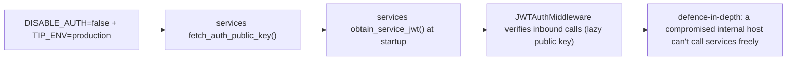
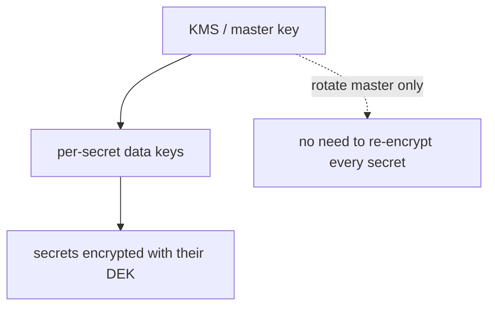
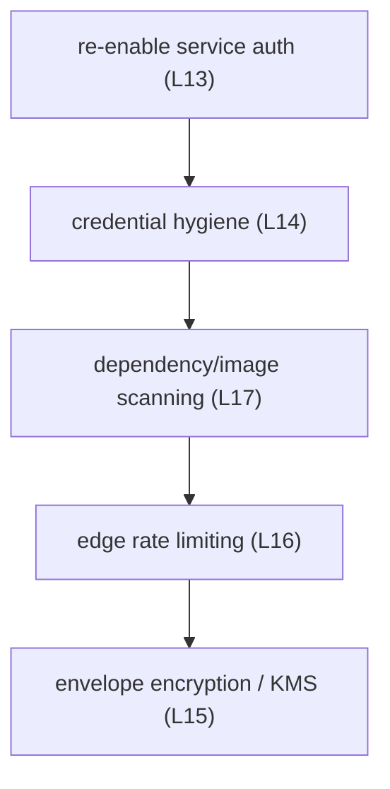

# Security Hardening

The remedy for the security limitations (L13–L17). The platform's edge
security is already strong (`08_security`); this roadmap restores
defence-in-depth and closes the deliberate internal relaxations.

## 1. Re-enable inter-service authentication (closes L13)

The most impactful item — and the cheapest, because the wiring is **dormant,
not deleted**.

The helpers (`wire_auth`, `obtain_service_jwt`, `fetch_auth_public_key`, the
lazy-key middleware) already exist (`10_implementation/runtime_behavior.md`).
The work is: populate `auth.service_accounts.bootstrap_token_hash` (Phase 2
Gap 2), add an auth healthcheck so startup ordering is clean, and flip the
flag. This converts the "hard shell, soft interior" posture into
defence-in-depth.

## 2. Envelope encryption / KMS for the vault (closes L15)

Today one `FERNET_KEY` encrypts every secret, and rotating it is a manual
re-encrypt of every row. The target is **envelope encryption**:

A master key (ideally in a managed KMS) wraps per-secret data keys, so master
rotation does not require re-encrypting the whole vault, and the blast radius
of any single key is reduced.

## 3. Edge rate limiting (closes L16)

The `rl:*` Redis infrastructure already exists; the work is to apply it
comprehensively at the BFF and on sensitive endpoints (login, `/ask`,
investigation) — per-user and per-IP windows — so a compromised internal
client cannot issue unbounded requests.

## 4. Dependency and image scanning (closes L17)

Add to CI (once CI exists, `production_hardening.md`):

| Tool | Scans |
|---|---|
| `pip-audit` | Python dependencies against known CVEs |
| Trivy | container images (OS + language packages) |
| ruff bandit (`S`) | in-code security smells (already configured) |

These run on every build, turning the current manual pinning into an
automated supply-chain gate (`08_security/dependency_security.md`).

## 5. Credential hygiene (closes L14)

- **Force admin password change on first login** — remove the `changeme`
  footgun.
- **Per-deployment unique bootstrap credentials** — ensure no shared default
  `SECRETS_BOOTSTRAP_TOKEN` across deployments.
- **Password policy** — minimum strength on user creation (argon2id is
  already the hashing scheme).

## 6. Audit and alerting on security events

The audit data already exists (`auth.audit_log`, `secrets.access_log`,
`orchestrator.notification_dispatches`). The hardening step is to **alert** on
anomalies — repeated failed logins, unusual secret-read patterns — by feeding
these into the monitoring stack (`production_hardening.md`) and the
notification subsystem.

## Sequencing

Service auth and credential hygiene first (high value, low effort, wiring
exists); KMS last (highest effort, requires an external key service). Each
step assumes CI exists to enforce the scanning gate.
