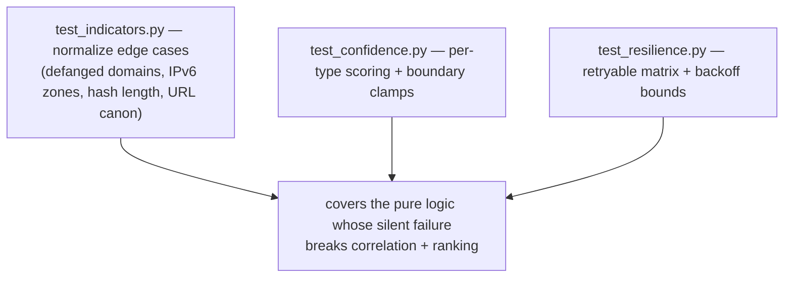
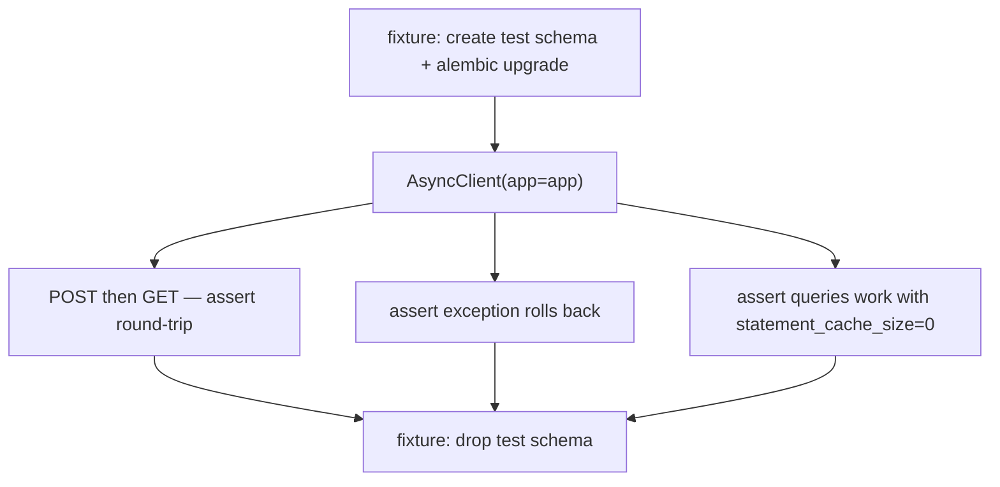
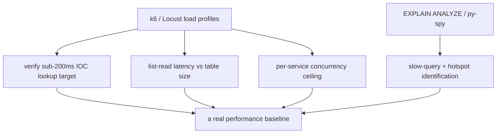
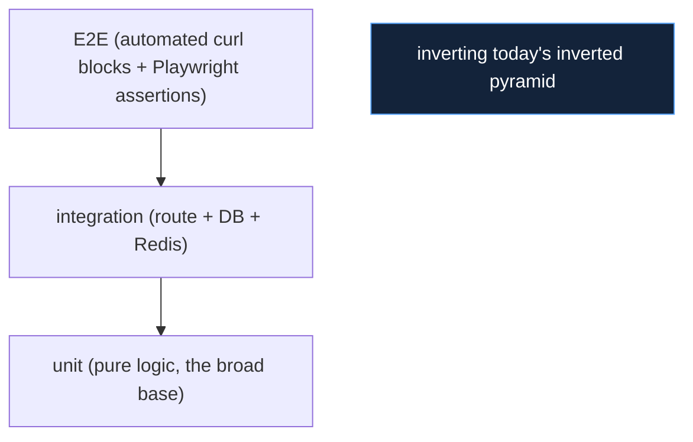

# Testing Roadmap

The remedy for the testing limitations (L1, L2, L3). The order is chosen so
each step builds confidence for the next, and so the highest-risk code is
covered first.

## Step 1 — the unit tranche (closes part of L1) — **P1**

Start with the pure, high-risk functions identified in
`11_testing/unit_testing.md`. They need no fixtures and run in milliseconds.

These three files cover the functions most damaging to get wrong:
`normalize` is the cross-service join key; `confidence` drives every ranking;
`resilience` governs all external-call behaviour. A regression in any of them
is currently invisible (`11_testing/coverage.md`).

## Step 2 — encode known regressions as tests (closes part of L1)

Every past regression in `11_testing/regression_testing.md` is a ready-made
test case — the bug, trigger, and correct behaviour are all documented:

| Past bug | Test that locks the fix |
|---|---|
| insight cache overwritten by empty | assert empty payload never replaces non-empty |
| login redirect loop | assert `/login` POST bypasses the no-token guard |
| KEV "exploited only" too few | assert KEV backfill resolves referenced CVE ids |

Writing these is mechanical and prevents recurrence — converting the git
history from a record of fixes into enforced guarantees.

## Step 3 — integration tests per service (closes rest of L1)

`pytest-asyncio` + `httpx.ASGITransport` against the app, with a disposable
schema per test module (`11_testing/integration_testing.md`):

Because services share no tables (`P1`), each service's integration tests are
independent — the architecture makes this cheap to add one service at a time.

## Step 4 — automate the E2E blocks (closes rest of L1)

The manual `curl` verification blocks (`11_testing/e2e_testing.md`) already
specify expected outcomes as `jq` assertions. Convert them to a `pytest`
suite that drives the live stack and asserts the same conditions — the
assertions exist; only the harness is missing.

## Step 5 — recorded source fixtures (deterministic parsing tests)

Record representative upstream responses (the legacy
`AvailableServices/.../fixtures/` pattern: `nvd_responses.py`,
`misp_responses.py`) and replay them so source-parsing and normalisation can
be asserted deterministically without a live network
(`11_testing/test_data_and_fixtures.md`). This converts the non-deterministic
"live data" fixture into a reproducible one for the parsing layer.

## Step 6 — performance benchmarks (closes L2)

The single most valuable benchmark is verifying the **sub-200ms IOC lookup
target** — the number the whole hot-path design is justified by, currently
unverified. The `duration_ms` instrumentation already exists
(`09_devops/observability.md`), so the data is capturable.

## Step 7 — OpenAPI-to-TypeScript codegen (closes L3)

Generate `frontend/src/types/*` from each service's `openapi.json` in CI, so
frontend types cannot drift from backend shapes. The `OpenAPI/` snapshots are
already the contract; codegen makes the contract enforced rather than
hand-maintained.

## The target test pyramid

The end state flips the current inverted pyramid (`11_testing/
testing_strategy.md`) into a conventional one: a broad unit base, a solid
integration middle, and a focused E2E top — with CI running all three on every
change.
