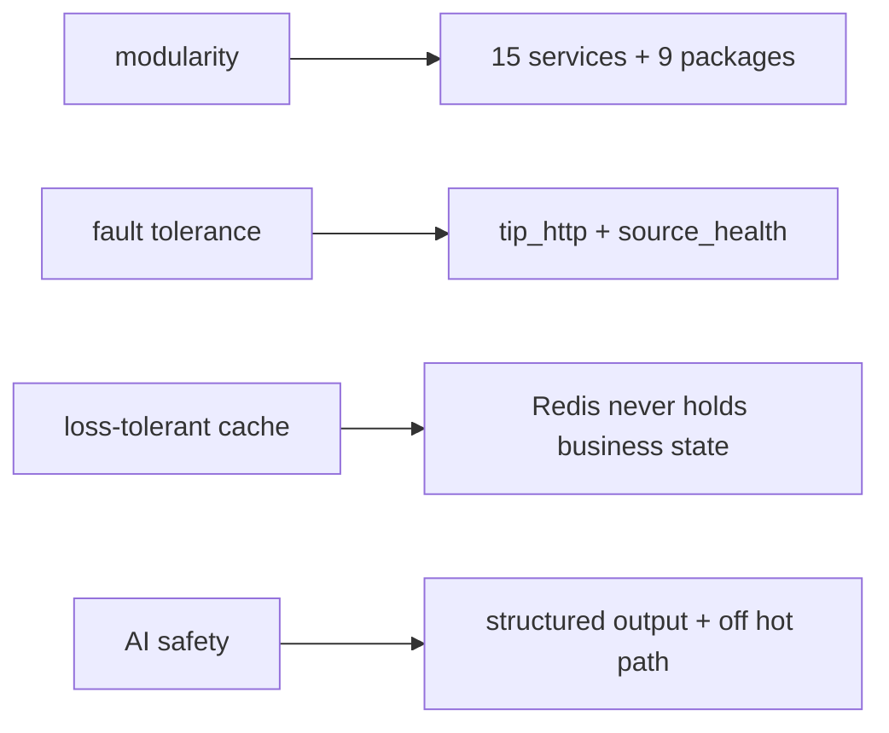

# Achievements

This document assesses what was accomplished against the objectives set in
`01_introduction/objectives.md`, honestly marking each as met, partially met,
or deferred.

## Functional objectives

| ID | Objective | Status | Evidence |
|---|---|---|---|
| F1 | Multi-source ingestion (CVE, IOC, actors, news, threats) | met | 15 services ingesting live feeds |
| F2 | Normalisation + deduplication | met | `tip_schemas.normalize`; SHA256 URL dedup; upsert-by-id |
| F3 | Confidence scoring with stored inputs | met | `tip_schemas.confidence`; `confidence_inputs` JSONB |
| F4 | Source health + fault tolerance | met | `source_health` tables; `fetch_with_resilience` |
| F5 | IOC hot-path lookup | met (target unverified) | Redis hot path; sub-200ms is a target, not benchmarked |
| F6 | CVE/EPSS/KEV intelligence | met | vuln-intel + KEV backfill |
| F7 | Threat-actor library (MITRE + ransomware) | met | threat-actors with STIX + ransomware.live |
| F8 | AI insights per resource | met | `generate_insight` + `*_insights` cache-first |
| F9 | 4-step analysis cycle | met | orchestrator analysis cycle → reports |
| F10 | Geopolitical prediction | met | `/analyze/geo` + dashboard card |
| F11 | Ad-hoc `/ask` | met | verified ("Lazarus" → 1355-char answer) |
| F12 | Attack-flow visualisation | met | flowviz + ReactFlow rendering |
| F13 | Passive investigation + dorking | met | indicator-intel; dorking verified (DuckDuckGo fallback) |
| F14 | Analyst contribution (notes, status, manual creation, overrides) | met | Phase 3 analyst layer |
| F15 | Configurable notifications | met | notification subsystem (SMTP verified) |

The functional surface is **substantially complete** — every headline
capability in the spec is implemented and exercised.

## Non-functional objectives

| ID | Objective | Status | Note |
|---|---|---|---|
| N1 | Resilience (degrade, never crash) | met | the defining property; circuit breaker + gather isolation |
| N2 | AI decoupled from ingest | met | AI never on the hot path |
| N3 | Service isolation | met | schema-per-service, no cross-schema FK |
| N4 | Security at the edge | met | RS256 JWT + RBAC at the BFF |
| N5 | Secret management | met | Fernet vault; only two secrets in `.env` |
| N6 | Observability | partial | structured logs + correlation IDs + health; no metrics stack |
| N7 | Performance (fast reads) | partial | designed + cached; not benchmarked |
| N8 | Maintainability | met | shared skeleton; uniform conventions |
| N9 | Deployability | met | one-command bring-up; per-service images |

The non-functional objectives are **met where they concern design and
correctness**, and **partial where they concern measurement and operational
tooling** (N6 metrics, N7 benchmarks) — exactly the gaps `15_limitations`
records.

## Design goals

The ten design goals (`04_solution_design/design_goals.md`) are realised in
the architecture:

## What was deferred (honestly)

| Deferred | Where addressed |
|---|---|
| Automated test suite | `16_future_work/testing_roadmap.md` |
| CI/CD, monitoring stack, backups | `16_future_work/production_hardening.md` |
| Inter-service auth (disabled by choice) | `16_future_work/security_hardening.md` |
| Watchlists, real-time push | `16_future_work/feature_roadmap.md` |
| Multi-host scaling | `16_future_work/scaling_roadmap.md` |

## Overall assessment

The project **achieved its core objective**: a single platform that replaces
the 10+-tool sprawl, ingests and scores intelligence from many sources, and
answers "who is most likely to attack us" through an AI synthesis layer that
keeps working when dependencies fail. The achievements are concentrated in
*capability and architecture*; the deferrals are concentrated in *operational
and verification maturity* — a coherent and defensible outcome for the
project's scope.
