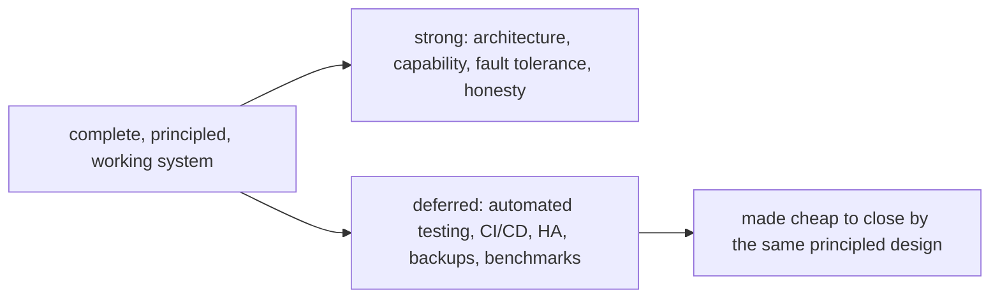

# Closing Assessment

## What this platform is

A complete, working Threat Intelligence Platform for a finance-sector
enterprise: fifteen FastAPI microservices and nine shared libraries behind a
Next.js application, ingesting from a dozen external intelligence sources,
normalising and scoring what they return, and layering AI synthesis on top to
answer the question the SOC team could not previously answer quickly — *who is
most likely to attack us, and what should we do about it.* It runs on a single
host with one command, on real data, and keeps running when its dependencies
fail.

## What makes it more than the sum of its services

The platform's value is not that it has fifteen services — it is that the
fifteen are governed by a small, consistent set of ideas:

- intelligence flows one way (sources → processed data → AI synthesis →
  analyst), so AI never sits on the ingest hot path and the pipeline survives
  an LLM outage;
- every service owns its schema and touches no other's, so the system is
  isolated, independently deployable, and split-ready;
- every external call degrades rather than crashes, so partial failure is the
  normal, handled case;
- every cross-cutting concern is solved once in a shared library, so the whole
  fleet improves when one library does.

These ideas are visible in the code, not just asserted in prose — in the
package list, the schema boundaries, the resilience wrapper, the LiteLLM
proxy, the cache-first insight tables.

## What it is honestly not

It is not a production-hardened, horizontally-scaled, fully-tested system. It
has no automated test suite beyond static analysis and smoke/visual checks, no
CI/CD, no metrics stack, no automated backups, and runs on one host with
inter-service authentication deliberately relaxed. These gaps are documented
without euphemism in `15_limitations` and given a prioritised remedy in
`16_future_work`. Crucially, they are gaps in *operational and verification
maturity*, not in architecture or capability — and the architecture was built
so that closing them is additive, configuration-level work rather than rework.

## The honest verdict

Measured against its objectives (`17_conclusion/achievements.md`), the project
**met its core goal and the great majority of its functional and design
objectives**, and **deferred the operational-maturity layer** that a
single-developer project on one host predictably defers. The work that remains
is well-understood and well-scoped precisely because the foundation was built
with discipline.

## Final word

This documentation suite was written to the same standard as the system it
describes: grounded in the real implementation, careful to distinguish what
was measured from what was designed, and willing to state plainly where the
platform falls short. A threat-intelligence platform exists to give an
organisation an honest picture of its risk; it would be incoherent to document
that platform any other way. The result is a system that does what it set out
to do, knows what it does not yet do, and has a clear path from one to the
other.
