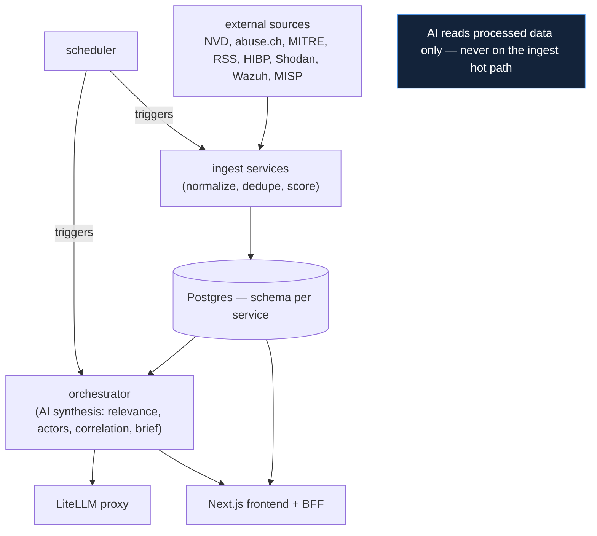

# Conclusion — Summary

## What the project set out to do

The platform addresses a concrete problem (`02_problem_statement`): a
finance-sector SOC team juggling 10+ disconnected tools and spending ~40
minutes per alert manually cross-referencing intelligence, with no single
answer to "who is most likely to attack us right now?" and no fast pivot from
an indicator to an actor.

The goal was a **Threat Intelligence Platform** that ingests from many
external sources continuously, normalises and deduplicates, scores for
confidence and relevance, and adds an AI layer that reads **processed data
only** to produce ranked, actionable intelligence — relevant CVEs, likely
actors, geopolitical predictions, and executive briefs — while remaining
operational when any single dependency (including the LLM) is down.

## What was built

A complete, working system:

| Dimension | Delivered |
|---|---|
| Backend | 15 FastAPI microservices, ~150 REST endpoints |
| Shared code | 9 `tip_*` libraries (settings, auth, db, cache, http, secrets, source-health, schemas, AI) |
| Data | one PostgreSQL database, schema per service, via PgBouncer |
| Cache | Redis hot path, loss-tolerant by design |
| AI | a single LiteLLM proxy with structured-output synthesis and a smart-model fallback cascade |
| Frontend | a Next.js 16 application (UI + BFF) across 27 pages for three personas |
| Deployment | a single-host Docker Compose stack, one-command bring-up |

It demonstrably runs on real data — thousands of IOCs, hundreds of articles
and actors, live CVE/KEV feeds — and produces substantive AI output
(`13_performance/benchmarks.md`).

## The architecture in one picture

## The principles that held throughout

The system is coherent because a small set of principles
(`04_solution_design/architectural_principles.md`) was applied uniformly:

- **P1** — no service touches another's tables; cross-service flow is
  HTTP/stable-IDs only.
- **G2** — degrade, never crash; partial success is success; stale over
  blocking.
- **AI off the hot path** — ingestion never calls the LLM, so data freshness
  is decoupled from AI availability.
- **Centralise the hard, decentralise the simple** — secrets, AI egress,
  pooling, and auth are single mediators; per-domain logic is 15 thin slices.
- **Decide once, share** — every cross-cutting concern is a `tip_*` library,
  not copied code.

These are not retrospective narration — they are visible in the code: the
package list, the schema boundaries, the resilience wrapper, the LiteLLM
proxy.

## How this document concludes

| Document | Content |
|---|---|
| `achievements.md` | what was accomplished against the stated objectives |
| `lessons_learned.md` | the honest engineering lessons |
| `closing.md` | the final assessment |

The conclusion is written in the same spirit as the rest of the suite:
claiming what is true, distinguishing what was measured from what was
designed, and naming what remains.
